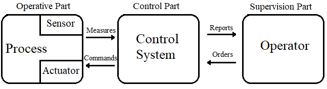
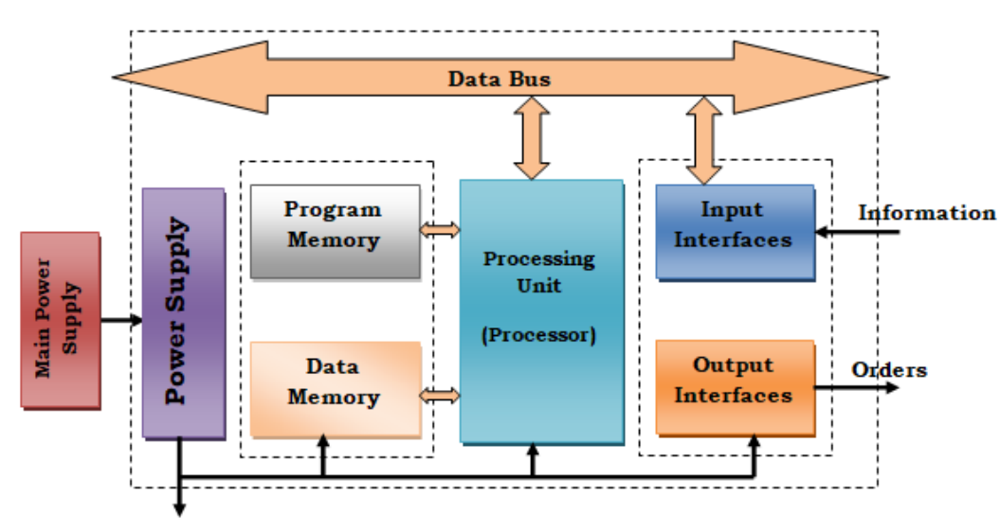
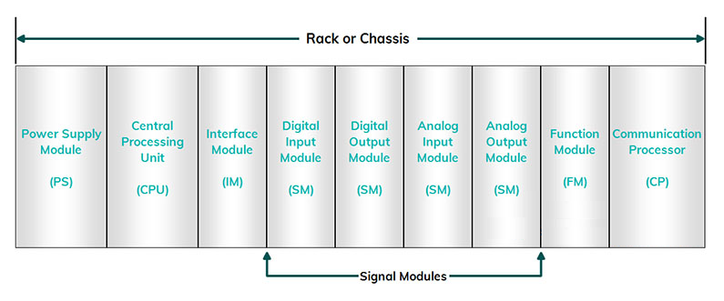
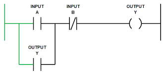
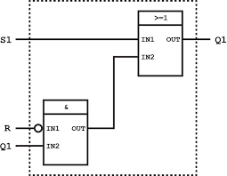
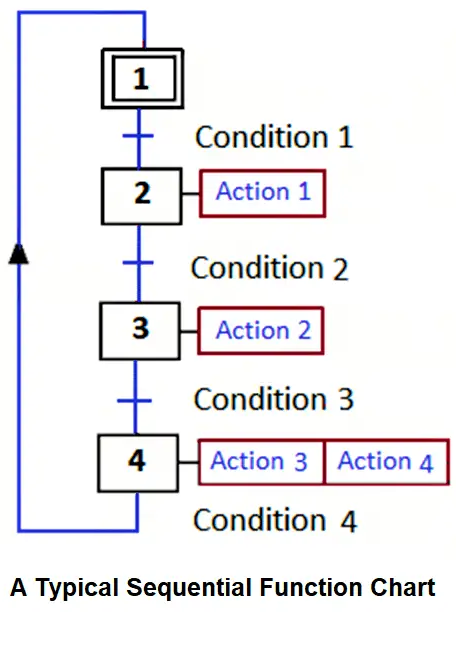

## Objectives
- Automation Systems
- Programmable Logic Controller
- PLC Programming Languages
## Automation System
### Introduction
An automation system is a technology designed to complete tasks without human intervention. These systems are widely used in industries to perform repetitive operations, offering advantages such as speed, precision, safety, and cost efficiency.  
Automation systems interact with their external environment through sensors, which collect data and signals. After receiving this input, the system processes the information using control elements and programmable logic controllers (PLCs). Based on these calculations, it executes actions via actuators.
With autonomous systems, industries can achieve "dark factories" fully automated production facilities that operate continuously, even at night, without the need for human supervision or lighting.
### Components of an Automated System
An automated system is made up of several components that work together to perform tasks with minimal human intervention. To better understand how it functions, we can divide the system into three main parts:
#### Operative Part (Power Part)
This is the visible and physical part of the system the "body" that acts directly on the raw material to transform it and add value. It is responsible for performing the actual operations like moving, assembling, or processing materials.  
To perform its functions, the operative part requires energy which can be electrical, pneumatic, or hydraulic and consists of three key elements:  
**Actuators**
Actuators are the "muscles" of the system. They receive energy and convert it into useful mechanical work, such as rotation or linear motion.
There are three main types of actuators:
- **Pneumatic actuators:** like air cylinders and motors.
- **Hydraulic actuators:** such as oil-driven cylinders.
- **Electric actuators:** such as electric motors.

**Pre-actuators**
Pre-actuators act as intermediaries between the control system and the actuators. They manage and distribute energy to the actuators based on the control commands received.
Types of pre-actuators include:
- Contactors  used to switch electric motors on/off.
- Variable speed drives to control the speed of electric motors.
- Distributors to direct compressed air or hydraulic fluid to pneumatic or hydraulic actuators.

**Sensors**
Sensors are the system's "eyes and ears." They monitor the operative part and provide real-time data about the system’s environment or status.  
They detect physical variables such as:
- Motion or position
- Presence or absence of objects
- Temperature, light, pressure, etc.

Sensors then convert this physical data into electrical signals that the control part can understand.
#### Control Part 
The control part is responsible for decision-making. It interprets data from the sensors and gives appropriate commands to the operative part.  
It functions based on:
- The program stored inside it (the logic or sequence of actions),
- Feedback from sensors,
- User input, such as buttons or switches.

This part typically includes programmable logic controllers (PLCs), microcontrollers, or other automated control units.
#### Supervision Part (The Operator Interface)
The supervision part acts as the communication link between the operator and the system. It includes control panels, buttons, indicator lights, screens, and Human-Machine Interfaces (HMI).  
Functions of the supervision part:
- Allows the operator to start, stop, or reset the system.
- Displays system status (e.g., running, error, idle).
- Helps with diagnostics and troubleshooting through visual feedback.



## Programmable Logic Controller
### Introduction
In the early days of automation, control systems were built using manual switches, relays, and analog devices. While these systems worked for simple tasks, they quickly became difficult to maintain as industrial processes grew more complex. The wiring became overwhelming, troubleshooting was time-consuming, and making changes often required rewiring the entire system.
To solve these problems, a major breakthrough occurred in the late 1960s: the invention of the Programmable Logic Controller (PLC). The PLC revolutionized automation by replacing complex wiring with programmable logic. This made systems easier to design, maintain, and modify, paving the way for the advanced automation we see today.
### Programmable Logic Controller
A programmable logic controller (PLC) is a programmable electronic device designed for controlling industrial processes through sequential processing. It sends orders to pre-actuators (operational part or OP on the actuator side) based on input data from sensors (control part or CP on the sensor side), setpoints, and a computer program. It is essential not to confuse a PLC with a microcomputer; although microcomputers can also control equipment by adding specific input/output cards, they are not as flexible to use as PLCs specially studied. The PLC receives information about the system's state and then controls the pre-actuators according to the program stored in its memory.
### Architecture Of Programmable Logic Controllers
A PLC generally consists of  modular components that are not integrated into a single block, but instead arranged side by side within a rack or chassis. This modular design allows for flexibility in system configuration components can be added, removed, or replaced based on the specific needs of the application.  
The main modules of a PLC include:
- Power Supply Module: Provides the necessary electrical power to the system.
- Central Processing Unit (CPU): The brain of the PLC, usually built around a microprocessor and equipped with memory storage (often EEPROM) to store programs and data.
- Input/Output (I/O) Interfaces: Used to connect the PLC to sensors (inputs) and actuators (outputs).
- Communication Modules: Allow the PLC to exchange data with other devices or systems (e.g., over Ethernet, Modbus, Profibus).
- Special Function Modules: Handle advanced tasks such as analog signal processing, high-speed counting, or motion control.    
- Programming Device: A computer or dedicated terminal used to write and upload programs to the PLC.

We can conisder PLC asc as a unit containing a large number of relays, counters, timers, and separate data storage units (usually EEPROM). 
The following figure shows the basic layout of a PLC:  

  

#### Power Supply Module
The power supply module provides electrical power to all other PLC modules. It plays a critical role by converting AC (Alternating Current) from the main power source into low-voltage DC (Direct Current) typically 24V DC which is required to operate the CPU, I/O modules, and other system components.
#### Central Processing Unit (CPU)
This module is the brain of the PLC It contains a microprocessor that performs all processing tasks in the program memory such as logical, arithmetic, and digital processing functions (transfer, counting, timing, etc.).
#### Internal Bus System
The internal bus is a set of electrical pathways that interconnect various PLC modules. It is divided into several sub-buses, each carrying specific types of information:
- **Data Bus** – Transfers actual data between modules.
- **Address Bus** – Specifies the location of data.
- **Control Bus** – Carries control signals (e.g. timing, data direction, validity).
- **Power Bus** – Distributes low-voltage DC power from the power supply.
#### Memory Zone
The memory in a PLC help us to stores the control program (logic instructions), hold temporary data such as input status, output commands, counters, and timers and allows the us to read, write, and delete data during operation or programming.
**Types of Memory:**
- RAM (Random Access Memory): Volatile memory used for temporary data and the active program. Contents are lost when power is off.
- ROM (Read-Only Memory): Non-volatile memory, permanently stores factory-defined instructions.
- EPROM (Erasable Programmable ROM): Can be erased using ultraviolet light and reprogrammed.
- EEPROM (Electrically Erasable Programmable ROM): Non-volatile and electrically reprogrammable. Used for user-defined programs and configurations.

Memory capacity is typically measured in bytes (1 byte = 8 bits).
#### Input/Output Interfaces
These interfaces allow the processor to receive and send information to external devices. 
**Input Interface:** It allows the reception of logical information from sensors and push-buttons of the console connected to the Programmable Logic Controller (PLC).  
**Output Interface:** It allows the central processing unit to transmit orders to various pre-actuators (relays, solenoid valves, etc.) and signaling elements (indicators) on the panel while providing electrical isolation.  
**Types of I/O Modules:**
- Digital Inputs/Outputs (DI/DO): Used for on/off signals (e.g. switches, contactors).
- Analog Inputs/Outputs (AI/AO): Used for variable signals (e.g. temperature sensors, pressure transducers, motor speed).
#### Programming Device
The programming device is used to create, modify, and load control programs into the PLC’s memory. Programs are typically written on a PC or a dedicated programming console provided by the PLC manufacturer, using specialized software.  
Once the program is developed, it is transferred to the CPU’s memory via a communication interface (such as USB, serial, or Ethernet).
#### Communication Module 
The communication interface is used to receive and transmit data over communication networks that connect the Programmable Logic Controller (PLC) to other distant PLCs. It concerns actions such as device verification, data acquisition, synchronization between applications, and managing the connection.  

    

## PLC Programming
### Introduction
PLCs use specific programming languages designed for automation and industrial control, which are quite different from the programming languages used for mobile or computer software development. These languages are designed to be intuitive for technicians and engineers who work with control systems.

PLC programming languages can be broadly classified into three main categories:
### Literal Languages
These are text-based languages that resemble traditional programming but are tailored for control logic. They are useful for complex operations and calculations. Common examples include:
#### Instruction List (IL)
Instruction List (IL) is a low-level, text-based PLC programming language that resembles assembly language. Programs are written as a series of instructions, each on a new line, with an operator followed by one or more operands. It works mainly with a temporary storage called the accumulator, where values are loaded, operations are performed, and results are stored. IL supports basic logic operations and can handle conditional execution and loops through comparison and jump instructions. While it is efficient and compact, IL is less commonly used today due to the rise of more user-friendly graphical and structured languages.  
**Example**
```
LD      Input1      // Load Input1 into the accumulator
AND     Input2      // Perform logical AND with Input2
ST      Output1     // Store the result in Output1

LD      Sensor1     // Load Sensor1 state
JMPC    Label1      // Jump to Label1 if Sensor1 is TRUE

// Continue normal operation
LD      0
ST      Motor

Label1:
LD      1
ST      Motor       // Start Motor if Sensor1 was TRUE
```
#### Structured Text (ST)
Structured Text (ST) is a high-level, text-based programming language for PLCs that closely resembles traditional programming languages like Pascal or C. It allows users to write more readable and organized code using structured blocks such as `IF`, `WHILE`, `FOR`, and `CASE`. ST is especially useful for complex operations, calculations, and decision-making processes. It supports variables, expressions, and functions, making it more powerful and flexible than low-level languages like Instruction List (IL). Because of its readability and similarity to common programming languages, ST is widely used in modern industrial automation.  

**Example:**
```
IF StartButton THEN
   Motor := TRUE;
ELSE
   Motor := FALSE;
END_IF;
```
### Graphical Languages
These languages use visual representations of control logic, making them easier to understand for those with an electrical background. The most common graphical languages are:
#### Ladder Diagram (LD)
Ladder Diagram (LD) is one of the most popular and widely used PLC programming languages. It was originally developed to resemble electrical relay logic diagrams, making it easy for electricians and technicians to understand. LD uses visual symbols like contacts and coils arranged on horizontal "rungs," similar to a ladder. Each rung represents a logic operation or control sequence, flowing from left (input conditions) to right (outputs or actions). It’s ideal for simple control tasks and visual troubleshooting.  
**Example:**
  

#### Function Bloc Diagram (FBD)
Function Block Diagram (FBD) is another graphical programming language used in PLCs that represents logic using interconnected blocks. Each block performs a specific function, such as an AND, OR, or timer operation. This language is especially useful for users who prefer visual representations and for designing control systems that involve signal processing, motion control, or repetitive logic. FBD helps in organizing complex logic into easy-to-read blocks, making it simple to understand how data flows through the system.

**Example:**

  

### Sequential Functional Chart (SFC / GRAFCET)
Sequential Functional Chart (SFC), also called GRAFCET (from the French **Graphe Fonctionnel de Commande Étape/Transition**), is a graphical programming language used to describe the sequence of operations in an automated system. It is especially useful for processes that follow a step-by-step or stage-based flow, such as machines with clearly defined operating stages (e.g., filling, heating, mixing, packaging).  
SFC breaks down a process into:  
- **Steps**: Represent the different states or actions of the system.  
- **Transitions**: Define the conditions that must be met to move from one step to the next. 
- **Actions**: What the system does during each step (e.g., turning on a motor, opening a valve). 
- **Conditions**: Logical checks (e.g., sensor signals, timers) that control when transitions occur.

The diagram starts with an initial step and flows vertically from top to bottom. Arrows guide the movement between steps based on transition conditions.  
**Example**  


