## Objectives
- Sequential Functional Chart
- Designing SFC

## Sequential Functional Chart
### Introduction
The Sequential Functional Chart (SFC) is a graphical programming language used to model and control the behavior of sequential automated systems, systems that progress through a series of defined steps in response to specific conditions or events. It is particularly popular in industrial automation for programming Programmable Logic Controllers (PLCs) and is standardized under the international IEC 61131-3 standard.  
SFC is conceptually based on the French method known as GRAFCET (_GRAphe Fonctionnel de Commande Étapes/Transitions_), which was developed in 1972 by the "logical systems" group of AFCET (French Association for Cybernetics and Technical Automation). GRAFCET laid the foundation for what became the SFC language, and it is still referenced in educational and engineering contexts, particularly in Europe.  
SFC diagrams consist of a limited but expressive set of graphical elements, such as steps, transitions, conditions, and actions, that collectively describe the logical flow of operations. This structure allows for intuitive modeling of complex control sequences, such as those found in manufacturing systems, robotic cells, or any process that requires ordered execution. 
### SFC Points of View
To understand or read a SFC , it is important to consider the perspective from which it is being interpreted. There are three different points of view:
#### System Point of View (Level 01)
The system point of view describes the operation of the automated system independently of sensors and actuators. It uses standard SFC elements such as steps, transitions, and directed links to represent the logical sequence of operations.  
This perspective is typically used during the design phase to define the functional structure of the process. It focuses on the overall behavior and sequence of the system without considering the underlying hardware.  
It is sometimes also referred to as the process-oriented view.   
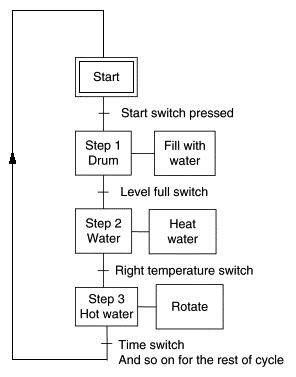   

#### Operative Part Point of View (P.O.) (Level 02)
The operative part point of view (P.O.) represents the system in terms of its physical components, including:
- Actuators: motors, cylinders, valves, etc.
- Sensors: position sensors, displacement, flow, pressure, temperature, etc.

This viewpoint focuses on how the physical process behaves, by integrating the actions and feedback of sensors and actuators into the SFC. It takes into account the technology and mechanisms used in the actual system.   
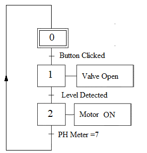   
#### Control Part Point of View (C.P.) (Level 03)
The Part Point of View (C.P) explicitly defines the logic of the control system itself. It focuses on how the control system (e.g., a Programmable Logic Controller or PLC) interprets inputs from sensors and other devices, processes them, and then generates outputs to activate pre-actuators and actuators to control the operative part.  
This view  describes how the control system will achieve the desired behavior of the automated machine, taking into account the specific hardware and software used. It is the most detailed level of SFC for implementing control logic.   
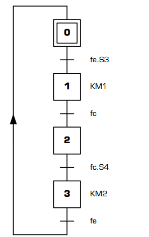   

### Construction Rules of a SFC
#### Step
A Step is represented by a square to which a unique number is associated. A Step can be initial (represented by a double square). A Step is either active or inactive. The whole of active steps (called situation) entirely defines the state of the system. We specify for each step, the actions to be executed. These actions are executed only when the corresponding step is active. We can associate a condition to those actions, the action is then executed only if the step is active and the condition is performed.   
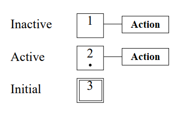  

#### Transitions
A transition is represented by a horizontal line. A transition represents a possibility of change of the comportment of the system. This change of comportment (the passage from one step to the following) corresponds to the crossing of a transition. A transition is validated when all previous steps are active. The logical proposal which conditions the transition calls the receptivity   
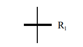   
#### Directed Arcs
Each directed arcs links a step to a transition or a transition to a step: there is always strict alternation: step-transition. When this connection is connection is directed upwards, we show the direction by an arrow upwards.  
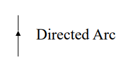   
#### AND Convergences / Divergences
**AND Convergences:** Directed arcs originating from multiple steps (known as downstream steps) converge at a single transition. These convergences are represented by two horizontal parallel lines.     
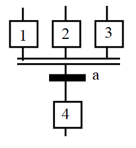   
Step 4 will be activated only if Steps 1, 2, and 3 are all active, and Transition "a" is true.  
**AND Divergences:** A directed arc starts from a single transition and splits into multiple steps (known as upstream steps). These divergences are also represented by two horizontal parallel lines.   
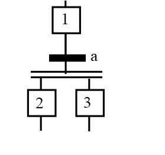   
Steps 2 and 3 will be activated simultaneously if Step 1 is active and Transition "a" is true. This allows us to achieve parallelism.
#### Example
Let’s suppose we have the following system composed of:
- A button (`btn`)
- Two wagons: CH1 and CH2
- Four sensors:
    - `l1` and `l2`: detect when CH1 and CH2 are at the left side
    - `r1` and `r2`: detect when CH1 and CH2 are at the right side

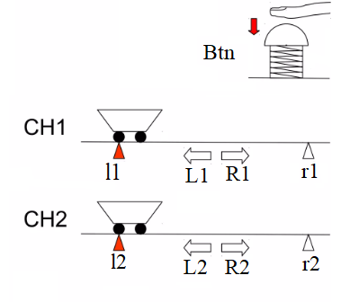   

**Working Cycle**
- Initially, both wagons start at the left position, detected by sensors `l1` and `l2`.
- When the user presses the button `btn`, both wagons begin moving to the right simultaneously.
- When a wagon reaches its corresponding right sensor (`r1` for CH1, `r2` for CH2), it immediately returns to the left without waiting for the other wagon.
- The other wagon continues its movement to the right independently and returns to the left when it reaches its own right sensor.
- The cycle is considered complete once both wagons return to the left side (detected again by `l1` and `l2`).

The system actions are represented using the following notations:
- **L1**: Move CH1 to the **left**
- **R1**: Move CH1 to the **right**
- **L2**: Move CH2 to the **left**
- **R2**: Move CH2 to the **right**

**Solution 1**    
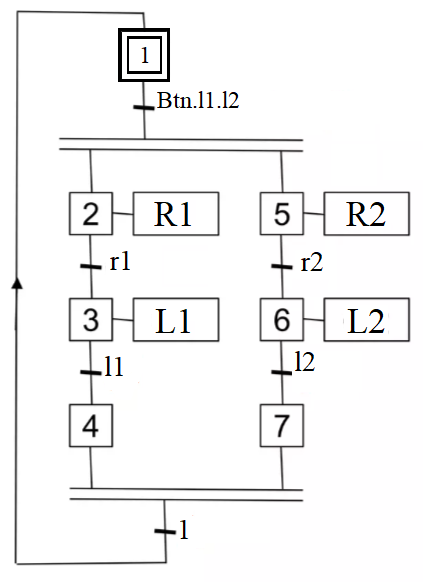   
**Solution 2**
We can simplify the system further by using two separate initial steps, each representing one wagon. When a wagon completes its cycle, it returns to its own initial step.  
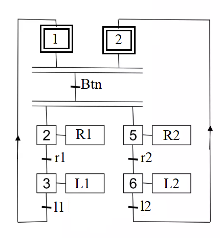  
#### OR Convergences / Divergences
**OR Convergences:**  Directed arcs originating from multiple transitions converge at a single step. These convergences are represented by one horizontal line.   
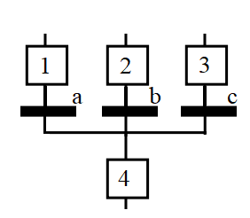  
Step 4 will be activated if one of Steps 1, 2, or 3 is active **and** the corresponding incoming transition is true.
**OR Divergences:** A directed arc starts from a single step and splits into multiple transitions. These divergences are also represented by one horizontal line.   
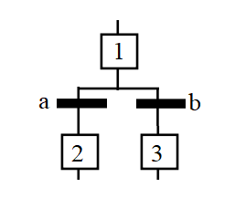  
Either Step 2 or Step 3 will be activated, depending on which transition (a or b) is true. This allows the system to select the path to follow based on specific conditions.
#### Example
Let’s suppose we have the following system composed of:
- Three buttons to select a floor (e.g., Floor 1, Floor 2, Floor 3)
- Two sensors, c and o, to detect if the door is closed or open
- Three position sensors: P1, P2, and P3 to detect the current floor of the elevator
- A motor to control the elevator’s movement  

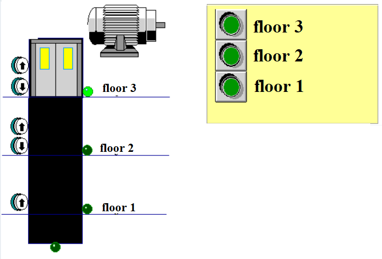  
 
 **Working Cycle**
- Initially, the elevator is located at one of the floors.
- When the user presses a button corresponding to a specific floor:
    - The door closes (detected by sensor c)
    - Once the door is fully closed, the elevator moves up or down depending on its current position and the selected floor.
- When the elevator reaches the target floor (detected by P1, P2, or P3):
    - The door opens (detected by sensor o)
- The cycle ends when:
    - The elevator has reached the selected floor, and
    - The door is confirmed to be open
The system actions are represented using the following notations:
- **OP**: Open the door
- **CL**: Close the door
- **MU**: Move Elevtor up
- **MD**: Move Elevtor down

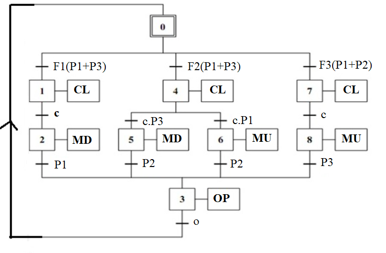  

#### The Step Jump
The step jump represents a conditional jump allowing to skip mutilple steps to activate a downstream step in sequence.  
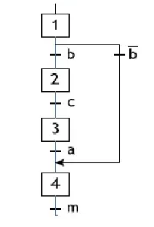  
If Step 1 is active and $\overline{b}$ is true, the system will jump ahead and skip Steps 2 and 3.
#### Repetitive Structure
A repetitive structure lso called a recovery of sequence, is a conditionl jump allowing the resumption of a sequence several times (loop) as long as a logical condition fixed is not obtained.  
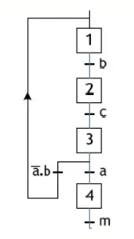  
Here, after Step 3 is activated, if Transition "a" is true, the system proceeds to Step 4. Otherwise, it returns to Step 1 and repeats the sequence. This behavior continues until Step 3 is active and Transition "a" becomes true.
## Designing SFC
### Rules of Evolution
#### Initial situation
The initial situation of an SFC (Sequential Function Chart) defines the starting behavior of the control system in relation to the operational part, the operator, and/or external elements. It is characterized by the steps that are active at the beginning of operation these are known as the initial steps.
#### Crossing a transition 
A transition is considered _validated_ when all immediately preceding steps connected to it are active. The transition is crossed when the transition is validated, **and** the receptivity condition associated with the transition is true.  
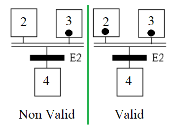  

#### Evolution of Activated Steps 
Crossing a transition simultaneously activates all immediately following steps and deactivates all immediately preceding steps.  
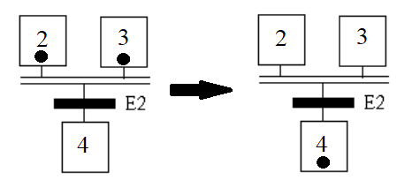  
#### Simultaneous Evolution 
Multiple transitions that are simultaneously crossable will be crossed at the same time.   
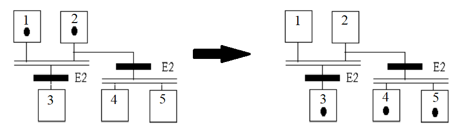  

#### Simultaneous Activation and Inactivation 
If, during operation, the same step is both activated and deactivated simultaneously, it remains **active**.   
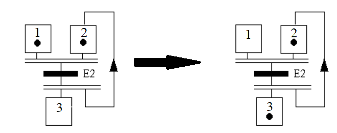   
### Examples
#### Example 1: Wagon
We have a system represented by a wagon that moves along a rail divided into four sections. Each section is equipped with a sensor that detects when the wagon has reached that point. The system also includes a start button that initiates the cycle when pressed.  
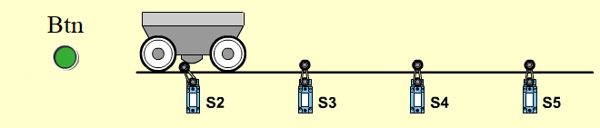

We are designing a Sequential Function Chart (SFC) to control the movement of a wagon, which follows the cycle described below:
- The wagon starts at position S2.
- When the start button is pressed, the wagon moves to S4.
- Once it reaches S4, it moves back to S3.
- After reaching S3, it proceeds to S5.
- Finally, after arriving at S5, the wagon returns to the starting position S2.

We represent movement to the right with the action W+, and movement to the left with the action W-.  
**Solution:**  

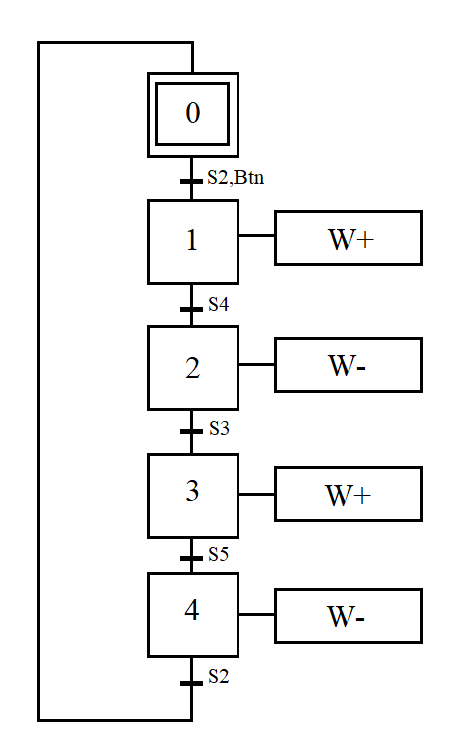  

#### Example 2: Machining head
We have a system represented by a machining head equipped with two motors: one controls vertical movement (up and down), and the other controls rotation. The system includes three sensors that detect the position of the head. Additionally, a start button is provided to initiate the cycle when pressed.  

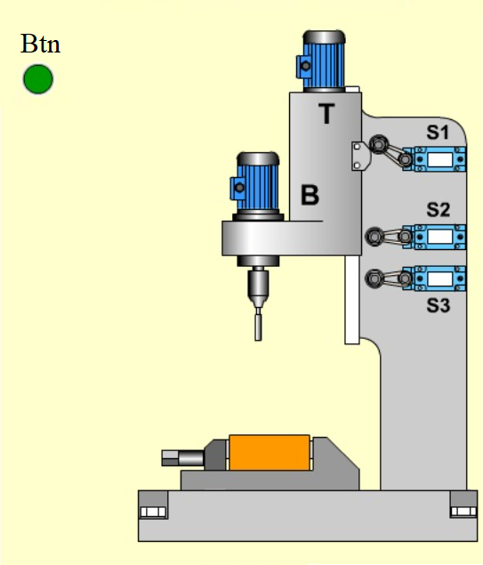  

We are designing a Sequential Function Chart (SFC) to control the operation of a machining head, which follows the cycle described below:
- The system starts at position S1.
- When the start button is pressed, motor T is activated to move the machining head downwards.
- Once the head reaches position S2, motor B is activated to initiate rotation.
- When the head reaches position S3, motor T reverses direction to move the head upwards.
- After the head returns to position S2, motor B stops, and motor T continues moving upward until the system returns to position S1.

We represent:
- Downward movement with T+
- Upward movement with T-
- Rotation with B+

**Solution:**
  
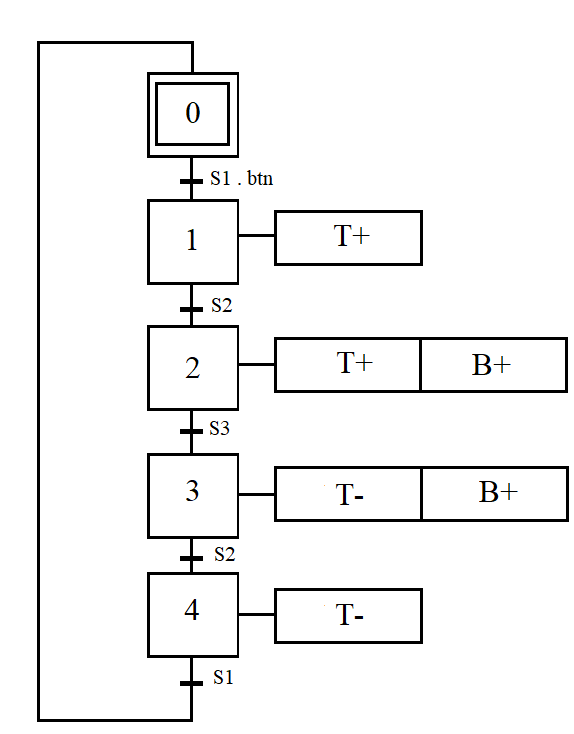  

#### Example3: Transfer piece
We have a system designed to transfer pieces along a production line. It consists of two cylinders and two grippers one for arrival and the other for evacuation. The system also includes five sensors to detect the positions and states of the components during operation.

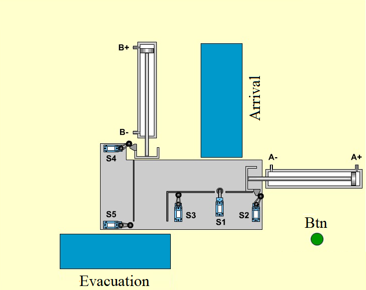  

We are designing a Sequential Function Chart (SFC) to control the process of transferring pieces along a production line. The system operates according to the following cycle:
- The system starts with Cylinder A in position S2 and Cylinder B in position S4.
- When the start button is pressed, arival gripper is activated.
- Once a piece arrives at position S1, the arrival gripper stops, and Cylinder A pushes the piece until it reaches position S3.
- When the piece reaches S3, Cylinder A returns to its initial position S2.
- Simultaneously, Cylinder B pushes the piece from S4 to position S5.
- Once the piece reaches S5, the evacuation gripper work Cylinder B returns to its initial position (S4).
- FInally after Cylinder B returns to its initial position S4 the system stop and return to initial state

We represent the system actions with the following notations:
- **GA**: Arrival gripper activated (working)
- **GE**: Evacuation gripper activated (working)
- **A+**: Cylinder A extends (moves out)
- **A-**: Cylinder A retracts (returns)
- **B+**: Cylinder B extends (moves out)
- **B-**: Cylinder B retracts (returns)
- **S6:** Indicate Piece out of evacuation grippe

**Solution:**
  
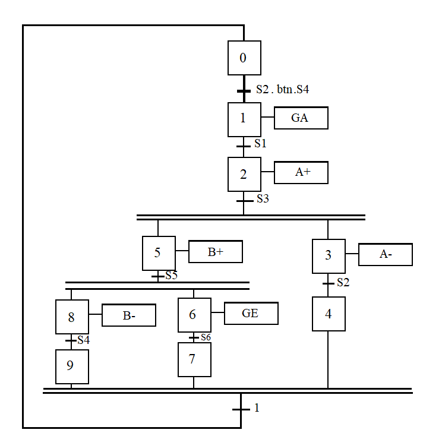  
