## Objectives
- Actions and Their Types
- Counter and Timer
- Macro 
## Actions
### Introduction
When working with SFC (Sequential Function Charts) and automated programs, we may encounter different types of actions. Sometimes, we need actions that remain active as long as the step is active. In other cases, we may want to delay the action for a certain amount of time before it starts, or keep it active only for a limited duration after the step is activated. In this section, we will explore how to handle these different types of actions effectively.
### Continued Actions
Continued actions are executed as long as the associated step is active. They continue running until the program transitions to the next step.
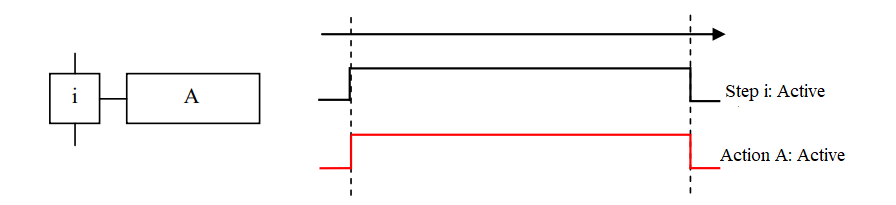
### Conditional Actions
Conditional actions run only when both the associated step is active **and** an additional specified condition is true.
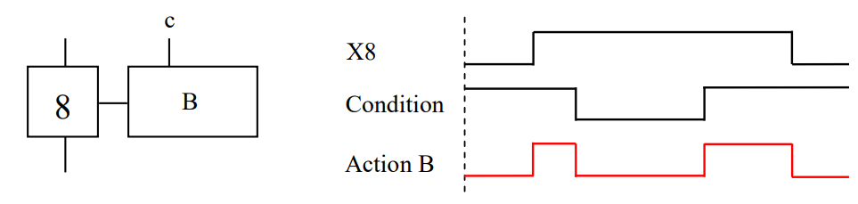
### Temporized Actions
Temporized actions are controlled by time-based conditions that define how and when the action is executed.
```
T1 / (X | C) / T2
```
- **T1**: The delay time after the step `X` or condition `C` becomes true before the action starts.
- **X | C**: The triggering element, which can be a step (`X`) or a condition (`C`).
- **T2**: The duration for which the action remains active after C expires.

The action stops either after T2 expires or if the associated step becomes inactive whichever comes first.  
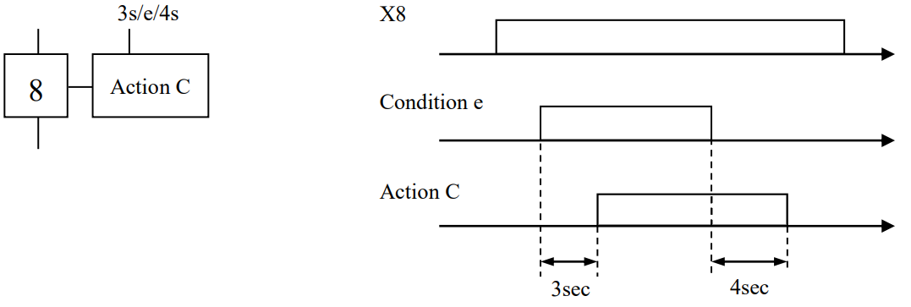
#### Delayed Action
This type of action waits for a delay time T1 after the step is activated, and then runs continuously until the step is deactivated.  
To implement it, we set the trigger of the timer to the current step (i.e., the step linked to the action) and configure the delay time as T1.  
The T2 duration is irrelevant in this case because the condition controlling the action is the step itself. As a result, the action will stop as soon as the step is deactivated, regardless of whether T2 has elapsed.  
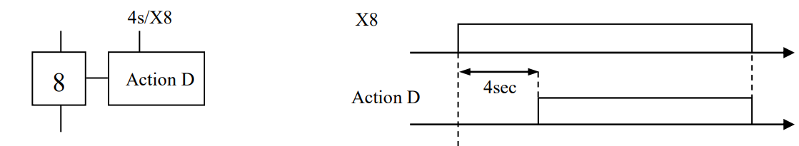
#### Limited Action
A limited action is an action that runs for a fixed duration T1 after the associated step is activated. It can be seen as the inverse of a delayed action.
To create a limited action:
- Set T1 as the duration for which the action should remain active.
- Use the step as the triggering condition.
- T2 can be omitted, as it is not relevant in this case.
- Finally, apply an overline ( $\overline{\phantom{T}}$ ) to the time condition to indicate that the action should stop after T1, even if the step remains active.  

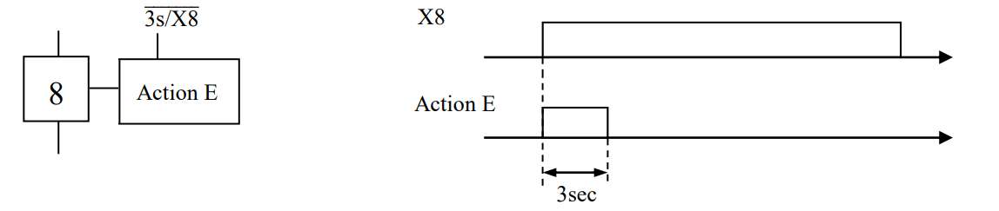
### Maintained Action
Maintained actions are actions that need to remain active across multiple steps. There are two main ways to implement a maintained action:
#### Non-Memorized Maintained Action
In this approach, the action is explicitly repeated in each step where it should remain active. As long as the action is defined in the current step, it will continue to run.  
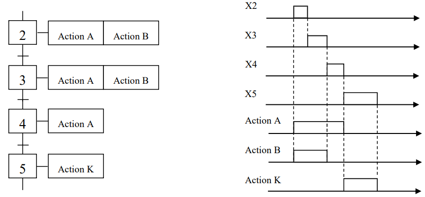
#### Memorized Maintained Action
Instead of repeating the action in every step, we use a memory mechanism. The action is activated (set to 1) in the step where it should start, and deactivated (set to 0) in the step where it should stop. This allows the action to stay active between those steps without being explicitly defined in each one.  

### Edged Actions
Edged actions are triggered by the rising or falling edge of the associated step. They are particularly useful when working with memorized actions, where we want to set or reset the state of an action based on transitions rather than keeping it continuously active.
Instead of continuously outputting a value of 1 while the step is active, an edged action only activates when it detects a rising edge (step transitions from inactive to active). Similarly, we can reset the action by using a falling edge (step transitions from active to inactive), which sets the state back to 0.  
Raising edge represented by up arrow and falling edge represented by down arrow.  
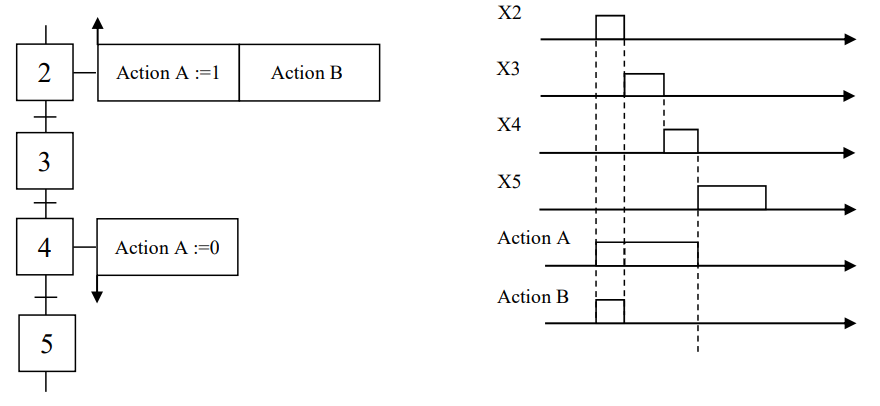  
#### Event Action
An event action is executed when the associated step is active and a specific internal event or condition becomes true. It is triggered only when the event occurs, not continuously while the step is active.
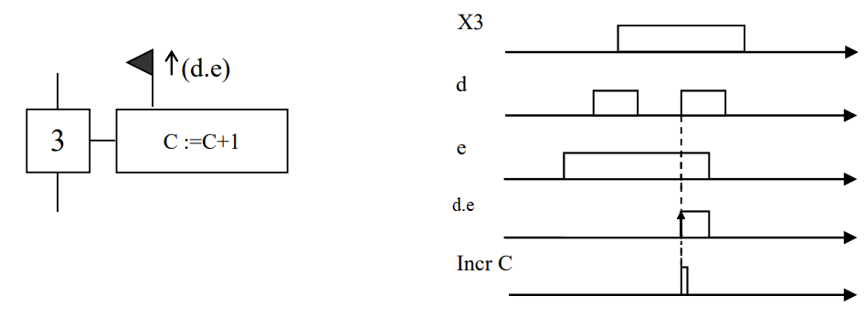
#### Remark
Edge detection can also be applied to receptivity conditions and transitions, allowing actions or state changes to occur only on the rising or falling edge of a condition.
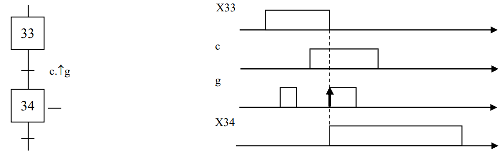  
## Counter and Timer
### Counter
Counters are used to count events or objects and define conditions based on numerical thresholds.  
For example, suppose we have a system that fills a container with pieces, and the container can hold only 5 pieces at a time. We can use a counter to track the number of detected pieces. Once the counter reaches 5, an action is triggered to empty the container.
To implement a counter:
1. Initialize the counter to 0.
2. Increment the counter each time a piece is detected (typically within a specific step).
3. Create a transition with a receptivity condition based on the counter value (e.g., `counter >= 5`) to trigger the next action, such as emptying the container.

#### Example
A bottle conveyor, driven by a three-phase electric motor, is controlled using a push button and a rod-type limit switch.  
When the push button is pressed, the conveyor starts. Once the limit switch detects the passage of **5 bottles**, the conveyor stops.  
A pulse counter is used to count the number of bottles as they pass the limit switch.  
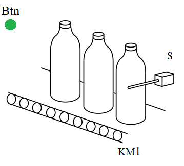  
**Solution:**  
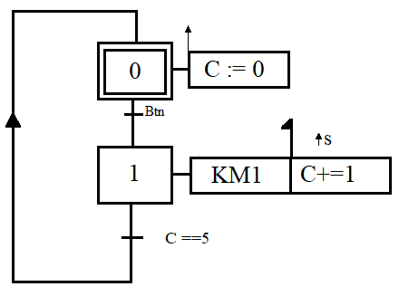  
### Timer
We previously saw how timers can be applied to actions to create limited, delayed, or temporized actions. In GRAFCET, timers can also be applied directly to steps by placing the timer in the receptivity condition of a transition. This allows a step to remain active for a defined duration T.  
The timer structure is the same as before:  
- **T1** is the duration for which we want the step to stay active.
- **C | X** represents the condition or step that triggers the timer typically, this is the step itself.
- **T2** can be omitted, as it is not needed in this case.

This approach ensures that the step remains active for a specific amount of time before transitioning.  
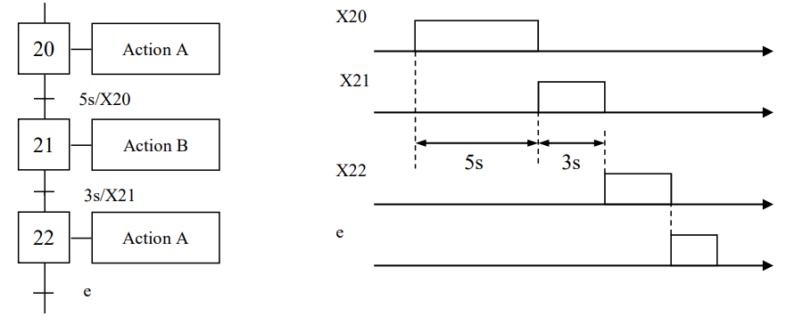
## Macro Step,Tasks
### Macro Step
When working with complex SFCs, the diagram can become large and difficult to read. To improve clarity and highlight specific structures without getting lost in the details, we use macro steps.
#### Definition
A macro step is a unique representation of a specific set of steps and transitions, referred to as the expansion of the macro step.  
Macro steps simplify the SFC structure, making it more readable and modular. They allow you to focus on higher-level logic by encapsulating detailed sub-processes within separate, reusable blocks.
#### Rules and Representation
- A macro step is prefixed with **M** and the step label. Example: M2.
- Each expansion contains:
    - An entry step labeled E
    - An exit step labeled S
- Activating the macro step automatically activates the entry step (E) of its expansion.
- The exit step (S) of the expansion is involved in validating the transition that follows the macro step in the main SFC.
- There is no structural link between the steps or transitions inside the expansion and those outside in the main SFC.
#### Important Notes
- Actions cannot be directly associated with a macro step itself.
- A macro step is not a step; it represents a collection of steps and does not follow the same execution rules as regular steps.
- A macro step and its expansion can only appear once in an SFC description.
- A macro step can have other macro steps inside it
- The body of the macro-step must have no link with other parts of the main diagram
#### Design Method
1. Identify the tasks that need to be separated.
2. Draw the main SFC using macro steps to represent each task.
3. Draw the expansion (internal structure) for each macro step, detailing the steps and transitions it encapsulates.

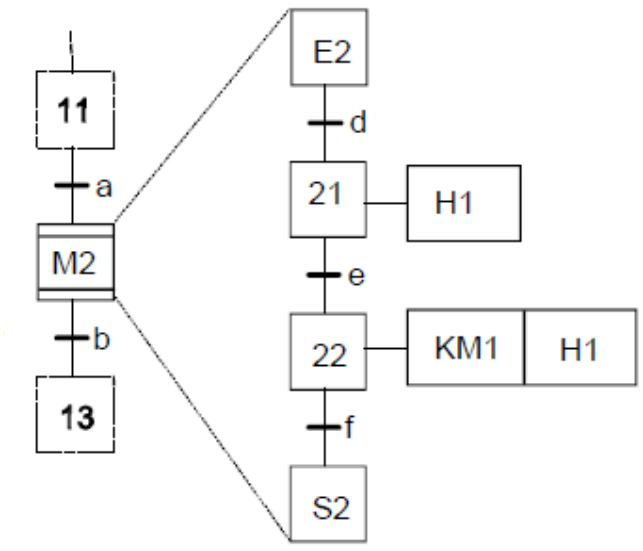  

### Task and Sub-Program
A task or subprogram is formed by a set of actions with accomplish a certain task. A sub-program can be called several times in the same grafcet. The sub-program structure has an input step and an output step, which have no associated action.  
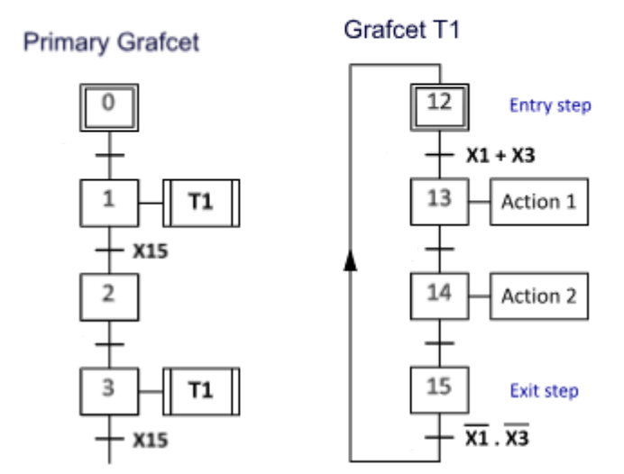  

### Connecting Two SFCs
It is also possible to link two SFCs using transition receptivity. This allows us to structure our control system into a main (or global) SFC and one or more sub-SFCs that perform specific tasks.
A sub-SFC can be activated when a transition condition in the main SFC is met. This modular approach improves clarity, simplifies debugging, and enables task-specific logic to be developed and maintained separately.  
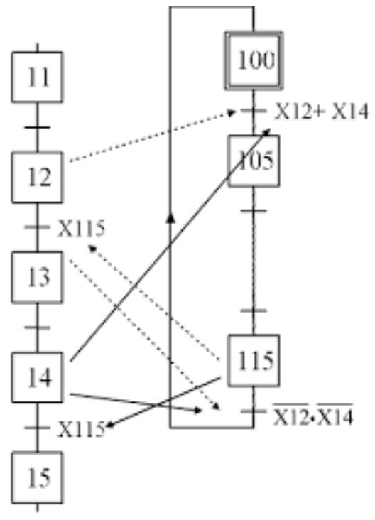  


