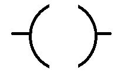
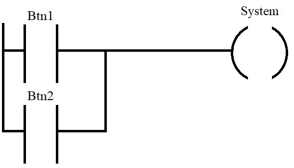
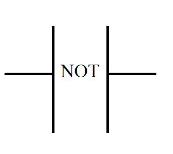
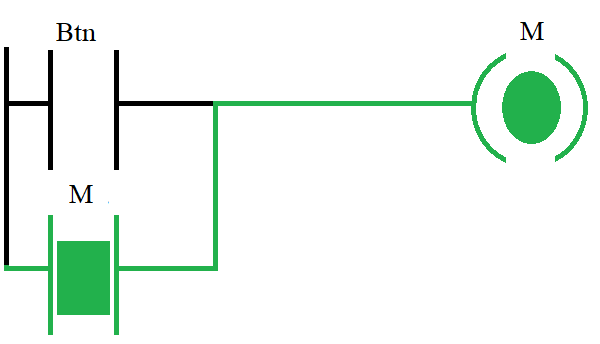

## Objectives
- Introduction to Ladder Logic
- Logical Operators
- Counter and Timer
## Introduction to Ladder Logic
### Introduction
Ladder Logic (also known as Ladder Diagram or LD) is a graphical programming language used to program Programmable Logic Controllers (PLCs). It represents logic operations using symbolic notations that resemble electrical relay circuits. Ladder logic is composed of horizontal "rungs" that together resemble the steps of a ladder hence the name Ladder Logic.  
The logic is designed to mimic traditional electrical wiring diagrams and is read from left to right, top to bottom.  
The organization responsible for standardizing ladder logic is PLCOpen. Ladder logic is not just a method for programming PLCs it is a standardized language defined under the **[IEC 61131-3](https://plcopen.org/iec-61131-3)** international standard for industrial control programming.
### Ladder Diagram Structure
A Ladder Diagram is structured using rungs, where each rung consists of a sequence of input instructions or function blocks, ending with an output coil. If the conditions on the left side of the rung evaluate to true, the output coil is activated (set to logic state `1`).  
One of the most basic and essential elements in a ladder diagram is the input instruction, which represents sensors or user inputs (such as push-buttons). These input instructions can be categorized into two types:
#### Normally Open (NO)
This instruction is open by default (logic state `0`) and becomes closed (logic state `1`) when the input condition is true (i.e., input signal is `1`).  
It is symbolized as:  
  
**Example:**  
We can use a Normally Open instruction to turn on a machine when the user presses a button. The button input becomes `1`, closing the contact and activating the output (e.g., motor).  
  
#### Normally Closed (NC)
This instruction is closed by default (logic state `1`) and becomes open (logic state `0`) when the input condition is true.  
It is symbolized as:  
  
**Example:**  
We can use a Normally Closed instruction to stop the system when a user presses a stop button. When the button is pressed, the input becomes `1`, opening the contact and deactivating the output.  
  
#### Output Coil
The Output Coil represents the result or action triggered by the logic conditions defined in a rung. It is always placed at the far right of the rung, and nothing comes after it in the diagram. 
The output coil is typically used to control actuators, such as motors, lamps, solenoids, or other output devices.  
It is symbolized as:   
   

When the conditions on the left side of the rung evaluate to true, the coil is energized (set to logic `1`), activating the connected device.
## Logical Operator
### Introduction
Sometimes, when building ladder diagrams, we need to express more complex logic to represent real-world systems. For example, an actuator may need to activate only if two conditions are met simultaneously, or if just one of multiple conditions is true. To handle such cases, we use logical operators like AND and OR.
### The AND Operator
The AND operator is used when multiple conditions must be true at the same time to trigger the output. In ladder logic, this is represented by placing input instructions in series (one after the other, horizontally).  
For example, if we want an output to activate only when both Button 1 and Button 2 are pressed, we would connect the two inputs in series like this:  
  
Equation is : Sytem = Btn1 . Btn2
### The OR Operator
The OR operator is used when any one of several conditions being true is enough to activate the output. In ladder logic, this is represented by connecting input instructions in parallel (in separate rungs vertically aligned with the same output).  
For example, if we want an output to turn on when either Button 1 or Button 2 is pressed (or both), we would connect the inputs in parallel like this:  
  
Equation is : Sytem = Btn1 + Btn2
### The Not Operator
The NOT operator is used to invert the state of the input instruction or function that appears to its left.  
If the original input is `1` (true), the NOT operator will turn it into `0` (false), and vice versa.
  
### Multiple Outputs
In some control systems, a single set of input conditions may need to activate multiple outputs. Ladder diagrams provide two ways to handle this situation by chaining outputs together:
#### Multiple Series Outputs
In this technique, outputs are connected in series, meaning they are placed one after another on the same rung.  
However, this approach has a major drawback:  
If one of the outputs fails or becomes inactive, all subsequent outputs in the series will also fail to activate.  
This makes it less reliable in critical applications.  
  
#### Multiple Parallel Outputs
Here, the outputs are connected in parallel, with each output having its own rung but sharing the same input conditions.    
This method is considered more robust and safer because:  
If one output fails, it does not affect the operation of the others.  
Parallel outputs ensure independent control and are typically preferred in professional ladder logic designs.  

### Memorizing State
So far, when creating rungs in a ladder diagram, we’ve connected input instructions directly to outputs. In this setup, if the input is high (ON), the output is also high. When the input goes low (OFF), the output turns off as well.  
However, this approach creates a limitation in systems controlled by a momentary push-button. For example, if we use a push-button to start a motor, the motor will only stay on as long as the button is being pressed. This is not practical for most applications, as we don’t want users to hold the button continuously to keep the system running.
#### Self-Holding 
One effective way to keep the output active after releasing the button is by using the self-holding technique. In this method, we add an additional input instruction in parallel with the push-button. This input represents the output itself, forming a feedback loop.  
The ladder diagram will look like this:  
  

After we press the button, the output (e.g., motor) turns ON, and the memory bit `M` is also set to ON. Even after the button is released, the parallel contact `M` keeps the circuit closed, allowing the system to remain active.  

The only issue now is that the system would stay ON indefinitely, with no way to stop it. To address this, we introduce a normally closed stop button in series before the output. Pressing this stop button breaks the circuit and turns the motor OFF.  
Here is how it looks:   

  
#### Set/Reset Coil
Another common method to store the state of an output in ladder logic is by using Set (S) and Reset (R) coils. This technique allows us to control an output using two separate buttons: a Start button and a Stop button.
- The Set coil sets the output to `1` (ON) and keeps it ON until it is explicitly reset.
- The Reset coil sets the output to `0` (OFF) and keeps it OFF until it is explicitly set again.  

**Example**  
We can control a motor using two push-buttons: one for Start and one for Stop.
- The Start button is connected to the Set coil. When pressed, it sets the motor output to ON.
- The Stop button is connected to the Reset coil. When pressed, it resets the motor output to OFF.
- If no button is pressed, the motor retains its previous state (this is known as memory behavior):
    - If it was ON, it remains ON.
    - If it was OFF, it remains OFF.
        
- If both buttons are pressed simultaneously, the execution order in the ladder program becomes important. Since ladder logic executes from top to bottom, the first coil encountered (Set or Reset) determines the final output state.
  
We can also use the SR (Set/Reset) block to represent the Set and Reset coils. This block has two inputs one for Set (S) and one for Reset (R) and one output that represents the current state of the block.  
The previous example using separate Set and Reset coils can be simplified using an SR block as follows:
- Connect the Start button to the Set (S) input.
- Connect the Stop button to the Reset (R) input.
- The output of the block will control the motor.

  
#### Example
Let’s suppose we have a system consisting of a garage door, three buttons, and two sensors:
- The buttons are:
    - Open: to open the garage door
    - Close: to close the garage door
    - Stop: to stop the door movement (either opening or closing)
- The sensors are:
    - One to detect when the garage door is fully open
    - One to detect when the garage door is fully closed

  
**Working Cycle**  
- When the user presses the Open button, the garage door starts opening and continues until the open sensor detects that it is fully open.
- When the user presses the Close button, the door starts closing and continues until the closed sensor detects that it is fully closed.
- If the Stop button is pressed at any time during opening or closing, the movement of the door is immediately halted.

The system actions are represented using the following notations:
- **FWD**: Opening the door (forward motion)
- **REV**: Closing the door (reverse motion)

**Solution**  
We can implement the ladder diagram using Set and Reset coils, as the actions need to be maintained (held) until the door is fully opened, closed, or the Stop button is pressed.
From the working cycle, we can conclude the following:
- The FWD (opening) action is set when the Open button is pressed, and it is reset either when the Stop button is pressed or when the open sensor detects the door is fully open.
- Similarly, the REV (closing) action is set when the Close button is pressed, and it is reset when either the Stop button is pressed or the closed sensor detects the door is fully closed.  

**Equations**  
- Set(FWD) = OPEN
- RESET(FWD) = UP + STOP
- Set(REV) = CLOSE
- RESET(REV) = DOWN+ S TOP

  
### Edge Detection
Edge detection is used to monitor changes in the state of an input, rather than continuously sending its current state. By using edge detection instructions, we can detect either a rising or falling edge of an input signal.  
This is especially useful when working with counters, as it ensures that the counter only increments or decrements once per input transition, rather than continuously counting while the input is high or low.  
    
#### Rising Edge (Positive Edge)
A rising edge (or positive edge) detects a transition from 0 to 1 (OFF to ON). It is triggered only at the moment the input changes from low to high. It is symbolized as follows:  
     
#### Falling Edge (Negative Edge)
A falling edge (or negative edge) detects a transition from 1 to 0 (ON to OFF). It is triggered only at the moment the input changes from high to low. It is symbolized as follows:  
    
#### OSR and OSF
we can also use 
## Counter and Timer
### Counter
A counter is a function block used to count events, either up or down, until a specified limit is reached. When the counter reaches this limit, its output is activated (set to ON).
There are three main types of counters:
- **Up Counter (CTU)**: Increments the count each time a triggering event (such as a rising edge) occurs. When the count reaches the preset value, the output is set.
- **Down Counter (CTD)**: Decrements the count with each event. The output is activated when the count reaches zero.
- **Up/Down Counter (CTUD)**: Can count both up and down based on separate inputs. Useful when events may increase or decrease a value depending on the situation.  
#### Up Counter (CTU)
The Up Counter (CTU) is useful when we want to count events or occurrences, such as the number of items passing on a conveyor.
- It starts counting from 0 and increments by 1 each time it receives a trigger signal (typically a rising edge).
- When the current count reaches the preset limit, the counter's output is set to 1 (ON).
- This output can then be used to trigger other actions in the system.

**Representation:**
The CTU block typically includes the following inputs and outputs:
- **CU (Count Up)**: The input that receives the trigger signal.
- **RESET (R)**: Resets the count to 0 when activated.
- **PV (Preset Value)**: The target count limit.
- **CV (Current Value)**: The current count.
- **Q (Output)**: Set to 1 when `CV >= PV`.

    
### Down Counter (CTD)
The Down Counter (CTD) is useful when we want to count down from a specific value to zero, such as tracking the number of available items or remaining operations.
- It starts from a preset value and decrements by 1 each time it receives a trigger signal (typically a rising edge).
- When the current value reaches 0, the counter's output is set to 1 (ON).
- This output can then be used to initiate a response, such as stopping a machine or triggering a refill.

**Representation:**
The CTD block typically includes the following inputs and outputs:
- **CD (Count Down)**: The input that receives the trigger signal.
- **LOAD (LD)**: Loads the preset value into the counter.
- **PV (Preset Value)**: The value from which the counter begins counting down.
- **CV (Current Value)**: The current count.
- **Q (Output)**: Set to 1 when `CV <= 0`.

    
### Up/Down Counter (CTUD)
The Up/Down Counter (CTUD) combines both counting up and counting down capabilities in a single block. It is especially useful when we need to track a balance that increases and decreases dynamically such as people entering and exiting a room, or parts added and removed from a system.
- It increments the current count when the Count Up (CU) input is triggered.
- It decrements the count when the Count Down (CD) input is triggered.
- The counter starts from a preset value or zero, and the output becomes active based on specific count conditions.

**Representation:**
The CTUD block typically includes the following inputs and outputs:
- **CU (Count Up)**: Trigger signal to increment the count.
- **CD (Count Down)**: Trigger signal to decrement the count.
- **RESET (R)**: Resets the counter to 0.
- **LOAD (LD)**: Loads a specific preset value into the counter.
- **PV (Preset Value)**: The value used as a comparison or starting point.
- **CV (Current Value)**: The current count.
- **QU (Up Output)**: Set to 1 when `CV >= PV`.
- **QD (Down Output)**: Set to 1 when `CV <= 0`.

    
#### Example
A bottle conveyor, driven by a three-phase electric motor, is controlled using a push button and a rod-type limit switch.
- When the push button is pressed, the conveyor starts moving.
- The limit switch detects the passage of bottles.
- After detecting 5 bottles, the conveyor automatically stops.

A pulse counter is used to count the number of bottles as they pass the sensor.

  
**Solution**
We can implement the control using Set (S) and Reset (R) coils because the conveyor motor needs to remain ON until 5 bottles pass, then turn OFF.
Based on the system operation cycle, we can define the logic as follows:
- KM1 (motor coil) is Set when the Start button (Btn) is pressed.
- KM1 is Reset when the counter reaches **5** (i.e., after 5 bottles pass).
- The Counter increments by 1 each time it receives a pulse from the sensor (S).
- Once the count reaches **5**, the counter output goes high and resets the motor coil.
- The Counter is also reset automatically after reaching the preset value to prepare for the next cycle

  
### Timers
A Timer is a function block used to introduce time delays in automation systems. It activates or deactivates an output after a specified amount of time has passed, based on an input condition. 
There are three common types of timers:
- ON-Delay Timer (TON): Delays turning ON an output after the input condition is true for a set duration.
- OFF-Delay Timer (TOF): Delays turning OFF an output after the input condition goes false.
- Pulse Timer (TP): Generates a fixed-length pulse when triggered, regardless of how long the input remains active.
### ON-Delay Timer (TON)
The TON timer is used when we want to delay the activation of an output. It starts timing when the input becomes true. If the input remains true for the full preset duration, the output turns ON.
- If the input goes false before the delay is completed, the timer resets and the output remains OFF.
- Useful in applications where we want to avoid reacting to short or accidental signals.

**Representation:**  
The TON block typically includes:
- **IN**: Input signal that starts the timer.
- **PT (Preset Time)**: The time delay before activating the output.
- **ET (Elapsed Time)**: Time passed since the input became true.
- **Q (Output)**: Set to 1 when `ET >= PT`.

  
### OFF-Delay Timer (TOF)
The TOF timer is used to delay deactivating an output. When the input signal turns OFF, the timer starts counting. Once the preset time elapses, the output is turned OFF.
- If the input is turned back ON before the timer finishes, the countdown resets and the output remains ON.
- Useful when we want to keep a device running briefly after a signal is lost (e.g. keeping a fan on after equipment is turned off).

**Representation:**  
The TOF block typically includes:
- **IN**: Input signal that maintains the output ON.
- **PT (Preset Time)**: The time to keep the output ON after input goes false.
- **ET (Elapsed Time)**: Time passed since input turned false.    
- **Q (Output)**: Set to 1 while input is ON, and remains ON during the delay after input goes OFF.

  
### Pulse Timer (TP)
The TP timer is used to generate a fixed-duration pulse. When the input becomes true, the output turns ON and stays ON for the preset time, regardless of whether the input stays ON or turns OFF.  
- Useful for triggering timed actions like buzzers, alarms, or one-shot pulses.

**Representation:**  
The TP block typically includes:
- **IN**: Trigger input signal.
- **PT (Preset Time)**: Duration of the output pulse.
- **ET (Elapsed Time)**: Time passed since pulse started.
- **Q (Output)**: Set to 1 during the time pulse is active (`ET < PT`).

  
#### Example
lets suppose weh have the following system that consist of two three-phase electric motors are controlled using two push-buttons (S1: Start and S2: Stop).  
When S1 is pressed, the first motor starts and runs for 5 minutes, then stops, and the second motor starts and runs for 10 minutes, and so on, alternating as shown in the following diagram.  
When **S2** is pressed, both motors stop immediately.  
  
The system actions are represented using the following notations:
- **KM1**: First Motor Working
- **KM1**: Second Motor Working

**Solution**  
We can implement the control logic using Set (S)** and Reset (R) coils to maintain the system's state, and two OFF-Delay Timers (TOF) to control the activation of the motors.  
Based on the system's operation cycle, the control logic can be described as follows:
- The system is set (activated) when the S1 button is pressed.
- The system is reset (deactivated) when the S2 button is pressed.
- KM1 is controlled by the output of TOF1 and the active system state. KM1 turns ON when the system is active and TOF1.Q is true.
- KM2 is similarly controlled by TOF2 and the system state. KM2 turns ON when the system is active and TOF2.Q is true.
- TOF1 is triggered by the rising edge of S1 combined with the inactive state of KM2, or by the falling edge of KM2.
- TOF2 is triggered by the falling edge of KM1.

**Equations**  
- SET(SYSTEM) = S1
- RESET(SYSTEM) = S2
- KM1 = SYSTEM . TOF1(Q) 
- KM2 = SYSTEM . TOF2(Q) 
- TOF1(IN) =  $\uparrow$S1.$\overline{KM2}$ + $\downarrow$KM2
* TOF2(IN) =  $\downarrow$KM1

