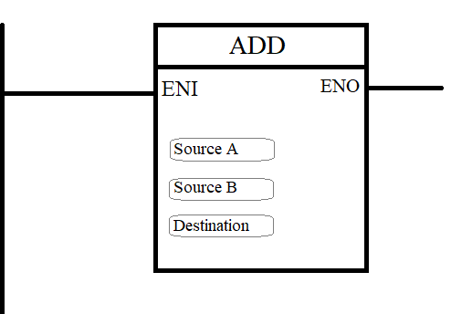

## Objectives
- Data types 
- Analog Input and Output
- Comparison Operators and Arithmetic Operators
- Translating from SFC to Ladder
## Data Types
### BOOL
The `bool` data type can have only two possible values: `1` (true) or `0` (false). It takes 1 byte of memory space. This is the most commonly used data type in ladder diagrams, primarily for input instructions and output coils.
### BYTE
The second data type is `byte`. It is used to store up to 8 bits, allowing values from 0 to 255. It is useful for representing small numbers and is commonly used when working with counters.
### WORD
The `word` data type occupies 16 bits (2 bytes) of memory space. It can store integer values ranging from 0 to 65,535 (in unsigned form) or from -32,768 to 32,767 (in signed form). This data type is commonly used for  analog values, and situations where larger numeric ranges are required compared to `byte`.
### DWORD
The `DWORD` (Double Word) data type occupies 32 bits (4 bytes) of memory space. It can store integer values ranging from 0 to 4,294,967,295 (unsigned) or from -2,147,483,648 to 2,147,483,647 (signed). It is typically used when dealing with large counters, long timer values, or data that requires a wide numeric range.
### INT
The `INT` (Integer) data type occupies 16 bits (2 bytes) of memory. It can store signed integer values ranging from -32,768 to 32,767. It is commonly used for arithmetic operations, counting, and representing values that can go negative or positive within that range.
### DINT
The `DINT` (Double Integer) data type uses 32 bits (4 bytes) of memory. It can store signed integers ranging from -2,147,483,648 to 2,147,483,647. It is useful for calculations that require large numbers or when dealing with high-resolution data in industrial automation.
### REAL
The `REAL` data type is a 32-bit (4-byte) floating-point type based on the IEEE 754 standard. It is used to represent decimal or fractional values, such as **3.14** or **-0.75**. This type is essential when precision is required in calculations, like in measurements, scaling, or analog value processing.
### TIMER
The `TIMER` data type is a special structured type used to represent and control timers in ladder logic programming. It typically includes elements such as:
- **.EN** (Enable): Indicates if the timer is currently active.
- **.TT** (Timer Timing): True while the timer is counting.
- **.DN** (Done): Becomes true when the timer completes.
- **.PRE** (Preset): The target time to count to.
- **.ACC** (Accumulated): The current elapsed time.
## Analog Input and Output
### Introduction
So far, we have worked with the `bool` data type, where all inputs and outputs were Boolean values either `0` (false) or `1` (true). These signals are typically generated by digital input devices such as push buttons and presence sensors.  
However, in industrial environments, some input devices and sensors provide analog values, such as temperature, distance, or motor rotation speed. To handle these types of signals, we need to use analog input and output instructions, which allow us to read and control continuous (non-binary) values.
### Analog Signal
In a PLC system, analog input modules typically receive signals in the range of 0–10V or 4–20 mA. These are standard signal formats used by most analog sensors to transmit physical values such as temperature, pressure, distance, or flow rate. 
However, these signals are just raw electrical values. To use them meaningfully in our program, we need to convert them into real-world engineering values. In TIA Portal, this process involves two key functions: `NORM_X` and `SCALE_X`.
#### Normalization `NORM_X`:
The analog input module converts the voltage or current signal into a digital value. For example, a 4–20 mA signal is typically mapped to a digital range of **0 to 27648** in Siemens PLCs.  
The `NORM_X` function is used to normalize the raw input value, it converts the raw signal into a value between 0.0 and 1.0.  
We need to provide:        
- `IN`: the address of the analog input (e.g., `%IW64`)       
- `HI`: the high limit of the input range (e.g., 27648)        
- `LO`: the low limit of the input range (e.g., 0)

  

#### Scaling `SCALE_X`:
The `SCALE_X` function scales the normalized value to the desired engineering units.  
We need to provide:
    - `VALUE`: the output of `NORM_X`
    - `MIN`: minimum value in engineering units (e.g., 0 PSI)
    - `MAX`: maximum value in engineering units (e.g., 100 PSI)

The result is a scaled value that represents the actual measurement.  
  
#### Example
Suppose we have a 4–20 mA pressure sensor, and we want to display the pressure in PSI.
1. Raw Input Range:
    - 4–20 mA corresponds to 0–27648 in the PLC’s digital input.    
2. Use `NORM_X`:  

  

3. **Use `SCALE_X`:**

  

Now `Scaled_Pressure` holds the actual pressure value in PSI, which can be used directly in our ladder logic for comparison, control, or display on an HMI.
## Comparison Operators and Arithmetic Operators
### Introduction
Ladder logic provides us with comparison and arithmetic operators, allowing us to perform more advanced operations with analog inputs after converting them into real-number values.  
Using comparison operators, we can evaluate analog values against thresholds or other variables, and based on the result, control the state of outputs.  
With arithmetic operators, we can perform mathematical operations such as addition, subtraction, multiplication, and division on these values. This enables us to build custom mathematical functions and add more sophisticated control logic to our system.
### Comparison Operator
#### Equal `(==)` Operator
This operator allows us to compare two values to check if they are equal.
- If the two values are equal, the output is 1 (true).
- If they are not equal, the output is 0 (false).

#### Not Equal (!=) Operator
This operator checks if two values are not equal.
- If the values are different, the output is 1 (true).
- If they are equal, the output is 0 (false).

#### Less Than (<) Operator
This operator checks if the first value is less than the second.
- If the first value is smaller, the output is 1 (true).
- Otherwise, the output is 0 (false).

  

#### Greater Than (>) Operator
This operator checks if the first value is greater than the second.
- If the first value is larger, the output is 1 (true).
- Otherwise, the output is 0 (false).

  

#### Less Than or Equal (<=) Operator
This operator checks if the first value is less than or equal to the second
- If it is, the output is 1 (true).
- If the first value is greater, the output is 0 (false).

  

#### Greater Than or Equal (>=) Operator
This operator checks if the first value is greater than or equal to the second.
- If it is, the output is 1 (true).
- If the first value is smaller, the output is 0 (false).

 

#### In-Range Operator
This operator checks if a value is within a specific range, inclusive.
- If the value is between or equal to the minimum and maximum limits, the output is 1 (true).
- If it falls outside the range, the output is 0 (false).

  

### Arithmetic Operators
#### Addition (+) Operator
This operator adds two numerical values together.   
We assign the addresses of the operands (the values to be added), and then specify the address where the result (sum) will be stored.  
  
#### Subtraction (−) Operator
This operator subtracts the second numerical value from the first.  
We assign the addresses of the operands, and then specify the address where the result (difference) will be stored.  
  
### Multiplication (×) Operator
This operator multiplies two numerical values.  
We assign the addresses of the operands, and then specify the address where the result (product) will be stored.
  
#### Division (÷) Operator
This operator divides the first numerical value by the second.  
We assign the addresses of the operands, and then specify the address where the result (quotient) will be stored.  
  
#### Modulo (MOD) Operator
This operator returns the remainder after dividing the first value by the second.  
We assign the addresses of the operands, and then specify the address where the result (remainder) will be stored.  
  

## Translating from SFC to Ladder
### Introduction
We have created programs using Ladder Logic to control our systems and learned how to build them step by step.  
But what if the system is represented using an SFC (Sequential Function Chart) diagram? How can we convert that into a Ladder Logic program?  
We can do that Using the set and reset Technique
### Set and Reset Technique
To convert an SFC diagram into Ladder Logic, the first step is to derive the logic equations that represent each transition condition.  
Next, we create the equations that will activate and deactivate each step in the sequence.  
Finally, we link each step to its corresponding actions to complete the control logic.  
In Ladder Logic:
- Activating a step is typically represented using a Set coil (SET).
- Deactivating a step is represented using a Reset coil (RESET).
### Examples
#### Example 1
Let’s suppose we have the following SFC diagram:  
  

To convert it into Ladder Logic, we follow these steps:  
We begin by identifying the transitions between steps:
- `Tr1 = S1`
- `Tr2 = S2`
- `Tr3 = S3`

Then we define step Activation and deactivation equations, a step is activated if the previous step is active and the preceding transition is valid.  
A step is deactivated if the next step becomes active.  
Using this logic, we can write the following equations:
- `SET(X2) = X1 · Tr1 = X1 · S1`
- `RESET(X1) = X1 · Tr1 = X1 · S1`
- `SET(X3) = X2 · Tr2 = X2 · S2`
- `RESET(X2) = X2 · Tr2 = X2 · S2`
- `SET(X1) = X3 · Tr3 = X3 · S3`
- `RESET(X3) = X3 · Tr3 = X3 · S3`

Now we associate actions (like turning on outputs) with the corresponding steps:
- `KM1 = X2`
- `KM2 = X3`

This means:
- When step `X2` is active, output `KM1` is ON.
- When step `X3` is active, output `KM2` is ON.

**Ladder Logic:**  
  
#### Example 2
Let’s suppose we have the following SFC diagram:  
   

To convert it into Ladder Logic, we follow these steps:  
We begin by identifying the transitions between steps:
- `Tr1 = S1`
- `Tr2 = S2`
- `Tr3 = S3`
- `Tr4 = S4`
- `Tr5 = S5`

Then we define step Activation and deactivation equations, a step is activated if the previous step is active and the preceding transition is valid.  
A step is deactivated if the next step becomes active.  
Using this logic, we can write the following equations:
- `SET(X2) = X1 · Tr1 = X1 · S1`
- `RESET(X1) = X1 · Tr1 = X1 · S1`
- `SET(X3) = X1 · Tr3 = X1 · S3`
- `RESET(X1) = X1 · Tr3 = X1 · S3`
- `SET(X4) = (X3 · Tr4) + (X2 . Tr2) = (X3 · S4) + (X2 . S2)`
- `RESET(X3) = X3 · Tr4 = X3 · S4`
- `RESET(X3) = X2 · Tr2 = X2 · S2`
- `SET(X1) = X4 . Tr5 = X4 . S5`
- `RESET(X4) = X4 · Tr5 = X4 · S5`

Now we associate actions (like turning on outputs) with the corresponding steps:
- `KM1 = X2`
- `KM2 = X3`
- `KM3 = X4`

This means:
- When step `X2` is active, output `KM1` is ON.
- When step `X3` is active, output `KM2` is ON.
- When step `X4` is active, output `KM3` is ON.

  
