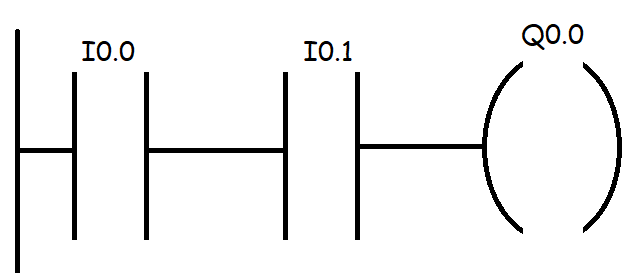
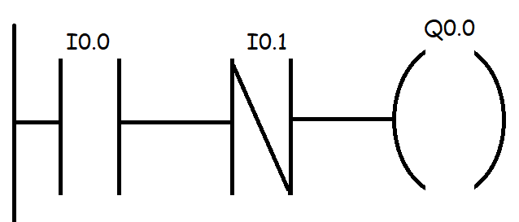
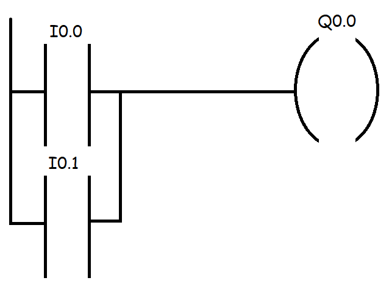
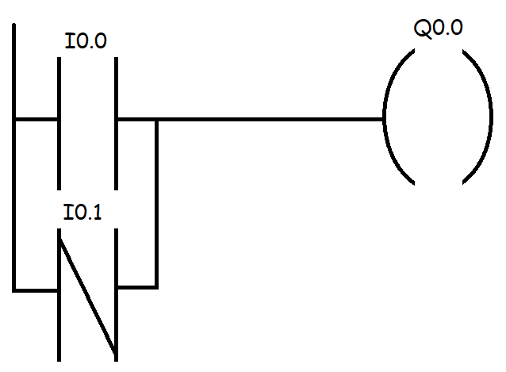
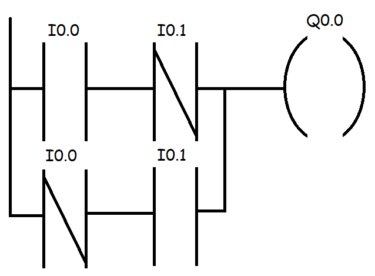
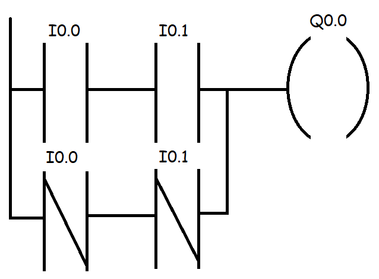

## Objectives
- Introduction to STL
- Bit Logic Instructions
- Arithmetic Operation
## Introduction to Statement List (STL)

### Introduction
Instruction List (IL) is a low-level, text-based programming language used to program Programmable Logic Controllers (PLCs). It represents logic operations using a series of mnemonic instructions that resemble assembly language. An IL program consists of a sequence of instructions, each on a new line, that manipulate values in a central accumulator (often called the "result register").  
The logic is designed to be executed sequentially by the PLC's processor and is read from top to bottom. Each instruction performs a specific operation on the current result in the accumulator.  
The organization responsible for standardizing PLC programming languages is PLCOpen. Instruction List is one of the five languages defined under the **[IEC 61131-3](https://plcopen.org/iec-61131-3)** international standard for industrial control programming.
### Instruction List Structure
An Instruction List program is structured as a series of instructions where each instruction begins on a new line and consists of an operator and an operand. The logic flows sequentially, with each instruction modifying the value stored in the accumulator based on the operation and the operand's state.  
## Bit Logic Instructions
Bit Logic Instructions perform Boolean operations on inputs, outputs, and memory bits. The core of these operations revolves around a central concept called the Result of Logic Operation (RLO), which is like a single-bit accumulator. Each logical instruction manipulates the RLO, and the final state of the RLO is then assigned to an output or memory bit.
### Boolean Operations
Boolean instructions are used to create logical expressions. They manipulate the RLO based on the state of inputs and memory bits.
#### Starting a New Logic String
To begin any new logic string, we must first load a value into the RLO. This is typically done with the A (AND), AN (AND Not), O (OR), or ON (OR Not) instructions. However, for clarity and best practice, it is often recommended to start a new segment of logic with the A or AN instruction.
- When we start with A or AN: We are explicitly telling the PLC, Forget whatever the RLO was before. Start a new calculation and load the state of this first contact (I0.0, for example) into the RLO. It creates a clean, predictable starting point.
    - `A I0.0` essentially means RLO = I0.0.
    - `AN I0.0` means RLO = $\overline{I0.0}$ .
- When we start with O or ON: We are telling the PLC, Take the value of this contact and perform an OR operation with the current RLO.
    - `O I0.0` means RLO = (current RLO) OR I0.0.
#### AND (A)
This instruction performs a logical AND operation.
- When used as the first instruction in a block, it loads the state of its operand directly into the RLO.
- When used after another instruction, it performs a logical AND between the current RLO and its operand, and stores the result back in the RLO.

The RLO will be 1 only if both the previous RLO and the operand are 1.  
**Example:** This logic implements the equation $Q0.0=I0.0\cdot I0.1$.
```
A I0.0      // Load the state of I0.0 into the RLO
A I0.1      // AND the RLO with the state of I0.1
= Q0.0      // Assign the final RLO to Q0.0
```

**Ladder Logic Representation:**   


#### AND Not (AN)
This instruction performs a logical AND with the inverse (NOT) of the operand.  
The RLO will be 1 only if the previous RLO is 1 and the operand is 0.  
**Example:** This logic implements the equation $Q0.0=I0.0\cdot \overline{I0.1}$.
```
A I0.0      // Load the state of I0.0 into the RLO
AN I0.1     // AND the RLO with the inverted state of I0.1
= Q0.0      // Assign the final RLO to Q0.0
```
**Ladder Logic Representation:**   

#### OR (O)
This instruction performs a logical OR operation. It is used to create parallel branches in the logic. The RLO will be 1 if the previous RLO is 1, OR if the operand is 1.  
**Example:** This logic implements the equation $Q0.0=I0.0+I0.1$.
```
A I0.0      // Load the state of I0.0 into the RLO
O I0.1      // OR the RLO with the state of I0.1
= Q0.0      // Assign the final RLO to Q0.0
```
**Ladder Logic Representation:**   
   
#### OR Not (ON)
This instruction performs a logical OR with the inverse of the operand.    
The RLO will be 1 if the previous RLO is 1, OR if the operand is 0.  
**Example:** This logic implements the equation $Q0.0=I0.0+\overline{I0.1}$.
```
A I0.0      // Load the state of I0.0 into the RLO
ON I0.1     // OR the RLO with the inverted state of I0.1
= Q0.0      // Assign the final RLO to Q0.0
```

**Ladder Logic Representation:**   


#### Exclusive OR (X)
The Exclusive OR instruction sets the RLO to 1 if the operands are different. If the previous RLO and the operand are the same (both 1 or both 0), the RLO becomes 0.      
**Example:** This logic implements the equation $Q0.0=I0.0\oplus I0.1=(\overline{I0.0}\cdot I0.1)+(I0.0\cdot\overline{I0.1})$.

```
A I0.0      // Load the state of I0.0 into the RLO
X I0.1      // XOR the RLO with the state of I0.1
= Q0.0      // Assign the final RLO to Q0.0
```

**Ladder Logic Representation:**   
   
   
#### Exclusive OR Not (XN)
This instruction performs an Exclusive OR with the inverse of the operand. This is equivalent to an XNOR (Exclusive NOR) operation, where the RLO is 1 if the operands are the same.  
**Example:** This logic implements the equation $Q0.0=I0.0\oplus\overline{I0.1}=(I0.0\cdot I0.1)+(\overline{I0.0}\cdot\overline{I0.1})$.
```
A I0.0      // Load the state of I0.0 into the RLO
XN I0.1     // XOR the RLO with the inverted state of I0.1
= Q0.0      // Assign the final RLO to Q0.0
```

**Ladder Logic Representation:**  
   
#### Assign (=)
The Assign instruction (=) concludes a logic string. It takes the final value of the Result of Logic Operation (RLO) and writes it to the specified operand (e.g., an output).  
**Example:**
```
= Q0.0
```
This instruction assigns the current value of the RLO to the digital output Q0.0. If the RLO is 1 (true), Q0.0 will be energized. If the RLO is 0 (false), Q0.0 will be de-energized.
#### Set (SET) and Clear (CLR)
Set (SET) and Clear (CLR) are immediate, unconditional instructions. They do not depend on the RLO. They directly force a bit to a specific state.
#### Set (SET)
The SET instruction sets the value of RLO to 1 (true).    
**Example:**
```
SET
```
This instruction forces the output RLO to be 1, regardless of the preceding logic. 
#### Clear (CLR)
The CLR instruction resets the value of RLO to 0 (false).   
**Example:**
```
CLR
```
This instruction forces the output RLO to be 0.
#### Conditional Set (S)
The S instruction sets the value of the address bit to 1 if the result of the RLO is 1 and the current value at that address is 0. If the value at the address is already 1, it does not change.
**Example:**
```
A I0.0
S Q0.0
```
After being set, the value will remain 1 until it is reset.
#### Conditional Reset (R)
The R instruction sets the value of the address bit to 0 if the result of the RLO is 0 and the current value at that address is 1. If the value at the address is already 0, it does not change.
**Example**
```
A I0.0
R Q0.0
```
After being reset, the value will remain 0 until it is set again.
#### NOT
The Not negate and inverse the state of the RLO, if RLO was 1 it turn it to 0 if it 0 it turn it to 1
```
A I0.0
NOT
= Q0.0
```
this equal to $Q0.0 = \overline{I0.0}$
### Combining Logic Blocks 
Real-world logic often requires combining series (AND) and parallel (OR) blocks. This is handled by controlling the order of operations.  
Let's implement the equation $Q0.0=(I0.0\cdot I0.1)+(I0.2\cdot\overline{I0.3})$. This translates to Q0.0 is ON if both I0.0 AND I0.1 are ON, OR if I0.2 is ON AND I0.3 is NOT ON.     
To do this correctly in STL, we process one complete AND block (a series branch) first, then connect the next AND block in parallel using an OR instruction.   
**Implementation:**
```
// First parallel branch
A  I0.0      // Load I0.0
A  I0.1      // AND with I0.1
             // The result of (I0.0 AND I0.1) is now in the RLO

// Second parallel branch
O            // Start a new parallel branch (OR)
A  I0.2      // Load I0.2 into a temporary check for this branch
AN I0.3      // AND with NOT I0.3

=  Q0.0      // Assign the final result of the OR operation to Q0.0
```
The instruction O with no operand is incorrect in standard STL.
### Nested Expression
When executing simple, sequential logic (like I0.0 AND I0.1 AND I0.2), a single RLO (Result of Logic Operation) bit is sufficient. The process is straightforward: the first instruction loads an initial value into the RLO, and each subsequent instruction modifies that RLO based on the logic.   
However, this simple model fails when we need to evaluate expressions with different priorities, such as (I0.0 OR I0.1) AND I0.2. The PLC must evaluate the expression inside the parentheses first. This is where the RLO stack becomes essential, To solve this issues we work with the RLO stack.  
The RLO stack is a small, temporary storage area that functions on a **Last-In, First-Out** (LIFO) principle.
1. When the PLC encounters the start of a nested expression (e.g., **A(** or **O(**), it saves the current RLO value onto the stack. This effectively pauses the main logic evaluation.
2. The PLC then treats the instructions inside the parentheses as a new, independent logic string. It evaluates this new string, and the result is stored in the RLO.
3. Once the closing parenthesis **)** is reached, the PLC retrieves the saved RLO value from the top of the stack. It then combines this retrieved value with the result from the nested expression, using the logic of the initial nesting instruction (e.g., AND for **A(**, OR for **O(** ).

The stack has a limited depth, typically 7 levels, which means we can nest up to 7 expressions within each other.   
If the very start of our PLC program (or a new logic network) begins with a nested expression (e.g., **A(**), the initial **(TRUE/1)** value of the RLO will be pushed onto the RLO stack.   
Inside the nested expression, the new RLO is set directly to the value of its first operand, regardless of whether that instruction is an A, O, AN or ON (for ON and AN it push the inverse if the input state).  
#### A(
With A( we can nest and expressions and then perform AND to them
**Example:** $Q0.0 = (I0.0+I0.2)\times I0.1$
```
A(
O I0.0
O I0.2
)
A I0.1
= Q0.0
```
#### AN(
With AN( we can nest and expressions and then perform AND Not to them 
**Example:** $Q0.0 = \overline{(I0.0+I0.2)}\times I0.1$
```
AN(
O I0.0
O I0.2
)
A I0.1
= Q0.0
```
#### O(
With O( we can nest and expressions and then perform OR to them 
**Example:** $Q0.0 = (I0.0\times I0.2) + I0.1$
```
O(
A I0.0
A I0.2
)
O I0.1
= Q0.0
```
#### ON(
With ON( we can nest and expressions and then perform OR Not  to them  
**Example:** $Q0.0 = \overline{(I0.0\times I0.2)} +\overline{(I0.1\oplus I0.3)}$
```
ON(
A I0.0
A I0.2
)
O(
A I0.1
X I0.3
)
= Q0.0
```
#### X(
With X( we can nest and expressions and then perform XOR  to them    
**Example:** $Q0.0 = (I0.0\times I0.2) \oplus (I0.1+I0.3)$
```
X(
A I0.0
A I0.2
)
X(
O I0.1
O I0.3
)
= Q0.0
```
#### XN(
With X( we can nest and expressions and then perform XOR  to them    
**Example:** $Q0.0 = \overline{(I0.0\times I0.2)} \oplus (I0.1+I0.3)$
```
XN(
A I0.0
A I0.2
)
X(
O I0.1
O I0.3
)
= Q0.0
```
### Edge Detector
#### FN Edge Negative
The FN instruction detects the falling edge of the RLO (Result of Logic Operation), which is a transition from a high to a low state. In each scan cycle of the program, it compares the previous RLO with the current one. If a change in state is detected, specifically a falling edge, it sets the RLO for the subsequent instruction to 1 for that one scan and saves the current state to the specified memory address.
```
A I0.0
FN M0.0
S Q0.0
```
- **First Cycle:** The program starts, and the initial state of I0.0 is 0. Therefore, the RLO is 0. The FN instruction receives an RLO of 0 and compares it to the previous RLO. Since this is the first cycle, the previous RLO is also considered 0. There is no falling edge detected. The RLO remains 0, M0.0 stores the current RLO (0), and Q0.0 is not set.
- **Second Cycle:** We set I0.0 to 1. The RLO becomes 1. When the FN instruction is executed, it compares the current RLO (1) with the previous RLO stored in M0.0 (which is 0). This is a rising edge (a change from 0 to 1). The FN instruction does not detect a falling edge, it update M0.0 to the current RLO state of 1 then set RLO to 0.. Consequently, Q0.0 is not set.
- **Third Cycle:** We set I0.0 back to 0. The RLO becomes 0. The FN instruction compares the current RLO (0) with the previous RLO stored in M0.0 (which is 1). This change from 1 to 0 is a falling edge. The FN instruction will save the current RLO (0) to M0.0 then set the RLO to 1 for this one scan. Because the RLO is now 1, the S Q0.0 instruction is executed, and the output Q0.0 is set to 1.
    
#### FP Edge Positive
The FP instruction detects the rising edge of the RLO (a transition from a low to a high state). In each scan cycle of the program, it compares the previous RLO with the current one. If a change in state is detected, specifically a rising edge, it sets the RLO for the subsequent instruction to 1 for that one scan and saves the current state to the specified memory address.
```
A I0.0
FP M0.0
S Q0.0
```
- **First Cycle:** The program starts, and the initial state of I0.0 is 0. This makes the RLO 0. The FP instruction compares the current RLO (0) with the previous RLO (also 0, as it's the first scan). No rising edge is detected. The output RLO remains 0, M0.0 stores the state of the current RLO (0), and Q0.0 is not set.
- **Second Cycle:** We set I0.0 to 1. The RLO becomes 1. The FP instruction compares the current RLO (1) with the previous RLO stored in M0.0 (which is 0). This change from 0 to 1 is a rising edge. The FP instruction will update M0.0 to the current RLO (1) then set the RLO to 1 for this one scan. Because the RLO is now 1, the S Q0.0 instruction is executed, and the output Q0.0 is set to 1.
- **Third Cycle:** We set I0.0 back to 0. The RLO becomes 0. The FP instruction compares the current RLO (0) with the previous RLO stored in M0.0 (which is 1). This is a falling edge. The FP instruction does not detect a rising edge it save the current RLO (0) to M0.0 and then set the RLO to 0. and the condition to set Q0.0 is not met.
