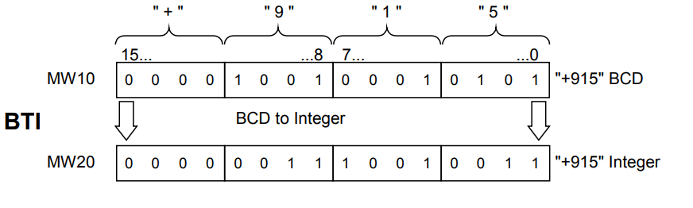

## Objectives
- Load and Transfer Instructions
- Comparison Instructions
- Conversion Instructions
- Math Instructions

## Load and Transfer Instructions
### Introduction
The Load (L) and Transfer (T) instructions enable us to program an interchange of information between input or output modules and memory areas, or between memory areas. The CPU executes these instructions in each scan cycle as unconditional instructions, that is, they are not affected by the result of logic operation of a statement.
### Load Instructions
#### The L (Load) Instruction
The **L** (Load) instruction is a fundamental command used to copy the value from a specified memory address into Accumulator 1 (ACCU 1). The accumulator is a special register in the PLC's CPU where data is temporarily held for processing.   
ACCU 1 is a 32-bit register, which can be broken down into smaller parts:
- Two 16-bit words:
    - ACCU 1-H (High Word): The upper 16 bits.
    - ACCU 1-L (Low Word): The lower 16 bits.
- Four 8-bit bytes:
    - ACCU 1-H-H (High-High Byte)
    - ACCU 1-H-L (High-Low Byte)
    - ACCU 1-L-H (Low-High Byte)
    - ACCU 1-L-L (Low-Low Byte)

How data is loaded depends on its size:
- Loading a Bit: When we load a single bit (a BOOL data type, which is either 0 or 1), it is placed into the least significant bit of ACCU 1-L-L. The remaining 31 bits of ACCU 1 are cleared to 0.  
- Loading a Byte (8 bits): A byte is loaded into ACCU 1-L-L. The upper 24 bits of ACCU 1 are cleared.
- Loading a Word (16 bits): A word is loaded into the low word of the accumulator, ACCU 1-L.
    - The first (high) byte of the word goes into ACCU 1-L-H.
    - The second (low) byte of the word goes into ACCU 1-L-L. The upper 16 bits of ACCU 1 (ACCU 1-H) are cleared.
- Loading a Double Word (32 bits): A double word fills the entire accumulator.
    - The first word (high word) is loaded into ACCU 1-H.
    - The second word (low word) is loaded into ACCU 1-L.

**Example:**
```
L I0.0 // Loads the state of digital input 0.0 (a bit) into ACCU 1.
L QB4 // Loads the value of output byte 4 into ACCU 1.
L MW10 // Loads the value of memory word 10 into ACCU 1.    
L MD20 // Loads the value of memory double word 20 into ACCU 1.
``` 
The data that existed in ACCU1 before the load move to ACCU2
#### The L STW (Load Status Word) Instruction
The L STW instruction is a specific command that loads the **Status Word** into Accumulator 1.  
The Status Word is a special 16-bit register in the PLC that contains important information about the results of previous operations and the current state of the program's execution. It's like a set of flags that indicate what happened after the last instruction was executed.  
When we execute L STW, the 16 bits of the Status Word are copied into the lower word of ACCU 1 (**ACCU 1-L**). The upper 16 bits of ACCU 1 (**ACCU 1-H**) are cleared to 0.  
Each bit in the Status Word has a specific meaning. Some of the most important bits include:  
- **/FC (First Check):** Indicates the first scan of the program.
- **RLO (Result of Logic Operation):** Stores the binary result (1 or 0) of the last logical instruction (e.g., AND, OR).
- **OV (Overflow):** Is set if the result of a mathematical operation is too large for the register.
- **OS (Overflow Stored):** A stored overflow bit.
- **CC1 & CC0 (Condition Code Bits):** Provide more detailed information about the result of an operation (e.g., whether the result was positive, negative, or zero).
- **BR (Binary Result):** Indicates the current binary state that can be passed to the next instruction.

#### AR1 && AR2 Address Registers
**AR1** and **AR2** are addressing registers used for indirect addressing. Instead of loading data directly from a memory address using instructions like `L`, we can first load the memory address into one of these registers and then access the data indirectly. Both **AR1** and **AR2** are 32-bit registers designed to hold memory pointers.
#### LAR1 && LAR2
The LAR1 and LAR2 instructions are used to load a 32-bit pointer value into Address Register  (AR1/AR2). Where it gets that value from depends on the variant of the instruction we use.   
**LAR1:**  
LAR1 loads address register AR1 with the contents of ACCU 1 (32-bit pointer). ACCU 1 and ACCU 2 remain unchanged. The instruction is executed without regard to, and without affecting, the status bits.  
```
LAR1
```
**LAR1 `<D>`:**
LAR1  \<D\>  loads address register AR1 with the contents of the addressed double word or a pointer constant. ACCU 1 and ACCU 2 remain unchanged.
```
LAR1 DBD 20
```
**LAR1 AR2:**
LAR1 AR2 loads address register AR1 with the contents of address register AR2. ACCU 1 and ACCU 2 remain unchanged. The instruction is executed without regard to, and without affecting, the status bits  
**LAR2**
LAR2 loads address register AR2 with the contents ACCU 1 (32-bit pointer). ACCU 1 and ACCU 2 remain unchanged. The instruction is executed without regard to, and without affecting, the status bits.
```
LAR2
```
**LAR2 `<D>`:**
LAR2 \<D\> loads address register AR2 with the contents of the addressed double word or a pointer constant. ACCU 1 and ACCU 2 remain unchanged.
```
LAR2 DBD 20
```
**Using Pointer:**  
LAR1 P#100.0 load the pointer to memory area address 100.0 into AR1. After this, AR1 points to byte 100, bit 0.
#### The T (Transfer) Instruction
The T (Transfer) instruction is the counterpart to the L (Load) instruction. While L copies a value from a memory location into ACCU 1, the T instruction copies the value from ACCU 1 to a specified memory location.   
The instruction does not change the contents of ACCU 1; the value is simply copied. The size of the data transferred depends on the address type you specify.  
- **Transferring a Byte:** If we specify a byte address, the lower byte of ACCU 1 (ACCU 1-L-L) is copied to that address.  
- **Transferring a Word:** If we specify a word address, the lower word of ACCU 1 (ACCU 1-L) is copied.
- **Transferring a Double Word:** If you specify a double word address, the entire 32-bit content of ACCU 1 is copied.

**Example:**
```
T Q0.0 // Transfers the RLO (Result of Logic Operation) to digital output 0.0.
T QB4 // Transfers the content of ACCU 1-L-L to output byte 4.
T MW10 // Transfers the content of ACCU 1-L to memory word 10.
T MD20 // Transfers the entire content of ACCU 1 to memory double word 20.
```
Unlike the L instruction, the T instruction does **not** affect the contents of ACCU 2.
#### The T STW (Transfer Status Word) Instruction
T STW (instruction T with the address STW) transfers bit 0 to bit 8 of ACCU 1 into the status word. The instruction is executed without regard to the status bits.
#### TAR1 & TAR2: Transferring from Address Registers
The TAR instructions do the opposite of the LAR instructions. Instead of loading a value into an address register, TAR copies the 32-bit pointer value from an address register into a specified memory location. This is useful for saving a pointer for later use.  
**TAR1 \<D\>**
TAR1 \<D\> transfers the contents of address register AR1 into the addressed double word . Possible destination areas are memory double words (MD), local data double words (LD), data double words (DBD), and instance data words (DID)
**TAR2 \<D\>**
TAR2 \<D\> transfers the contents of address register AR2 into the addressed double word . Possible destination areas are memory double words (MD), local data double words (LD), data double words (DBD), and instance data words (DID)
**TAR1 (to ACCU 1)**
TAR1 transfers the contents of address register AR1 into ACCU 1 (32-bit pointer). The previous contents of ACCU 1 are saved into ACCU 2.
**TAR2 (to ACCU 1)**  
TAR2 transfers the contents of address register AR2 into ACCU 1 (32-bit pointer). The previous contents of ACCU 1 are saved into ACCU 2.
### CAR
CAR (swap address register) exchanges the contents of address registers AR1 and AR2. The instruction is executed without regard to, and without affecting, the status bits. The contents of address register AR1 are moved to address register AR2 and the contents of address register AR2 are moved to address register AR1.
```
CAR
```

## Comparison Instructions
### Introduction
With comparison operators, we can compare two numerical values and set the RLO (Result of Logic Operation) based on the result of the comparison. This is useful for defining conditions in a program.
### Integer Comparaison 16 bit
Integer comparison involves comparing the contents of ACCU 2-L with the contents of ACCU 1-L. The RLO (Result of Logic Operation) is then set based on the result of this comparison. The following instructions are used to compare two integer values:

| Operator | Action                   |
| -------- | ------------------------ |
| >I       | Greater than             |
| <I       | Less than                |
| \=\=I    | Equal to                 |
| <>I      | Not equal to             |
| >=I      | Greater than or equal to |
| <=I      | Less than or equal to    |
- Use the L (Load) instruction to load the first operand. This places the value into ACCU1.
- Load the second operand using another L instruction. This shifts the previous value from ACCU1 to ACCU2, and places the new value in ACCU1.
- Finally, use the appropriate comparison instruction (e.g., >I, \=\=I) to compare the two values.

**Example:** 
Turn Q0.1 to High if 5 < 7
```
L 5
L 7
<I
= Q0.1
```
### Double Integer Comparaison 32bit
Integer comparison involves comparing the contents of ACCU1 with the contents of ACCU 1. The RLO (Result of Logic Operation) is then set based on the result of this comparison. The following instructions are used:

| Operator | Action                   |
| -------- | ------------------------ |
| >D       | Greater than             |
| \<D      | Less than                |
| \=\=D    | Equal to                 |
| <>D      | Not equal to             |
| >=D      | Greater than or equal to |
| <=D      | Less than or equal to    |
- Use the L (Load) instruction to load the first operand. This places the value into ACCU1.
- Load the second operand using another L instruction. This shifts the previous value from ACCU1 to ACCU2, and places the new value in ACCU1.
- Finally, use the appropriate comparison instruction (e.g., >D, \=\=D) to compare the two values.

**Example:** 
Turn Q0.1 to High if 4999 \=\= 4999
```
L 4985
L 4999
==D
= Q0.1
```

### Floating-Point Number Comparaison 32bit
The Compare Floating Point Number (32-bit, IEEE 754) instructions compare the contents of ACCU 2 with the contents of ACCU 1. The contents of ACCU 1 and ACCU 2 are interpreted as floating-point numbers (32-bit, IEEE 754). The RLO (Result of Logic Operation) is then set based on the result of this comparison. The following instructions are used:

| Operator | Action                   |
| -------- | ------------------------ |
| >R       | Greater than             |
| \<R      | Less than                |
| \=\=R    | Equal to                 |
| <>R      | Not equal to             |
| >=R      | Greater than or equal to |
| <=R      | Less than or equal to    |
- Use the L (Load) instruction to load the first operand. This places the value into ACCU1.
- Load the second operand using another L instruction. This shifts the previous value from ACCU1 to ACCU2, and places the new value in ACCU1.
- Finally, use the appropriate comparison instruction (e.g., >R, \=\=R) to compare the two values.

**Example:** 
Turn Q0.1 to High if 1.8 > 3.14
```
L 1.8
L 3.14
>R
= Q0.1
```
## Conversion Instructions
### BTI BCD to Integer (16-Bit)
BTI (decimal to binary conversion of a 3-digit BCD number) interprets the contents of ACCU 1-L as a three-digit binary coded decimal number (BCD) and converts it to a 16-bit integer. The result is stored in the low word of accumulator 1. The high word of accumulator 1 and accumulator 2 remain unchanged.  
The permissible value range for the BCD number is from "-999" to "+999". Bit 0 to bit 11 are interpreted as the value and bit 15 as the sign (0 = positive, 1= negative) of the BCD number. Bit 12 to bit 14 are not used in the conversion. If a decimal (4 bits) of the BCD number is in the invalid range of 10 to 15, a BCDF error occurs during attempted conversion.
```
L MW10 //Load the BCD number into ACCU 1-L. 
BTI //Convert from BCD to integer; store result in ACCU 1-L. 
T MW20 //Transfer result (integer number) to MW20.
```
  
### ITB Integer (16-Bit) to BCD
ITB (binary to decimal conversion of a 16-bit integer number) interprets the contents of ACCU 1-L as a 16-bit integer and converts it to a three-digit binary coded decimal number (BCD). The result is stored in the low word of accumulator 1. Bit 0 to bit 11 contain the value of the BCD number. Bit 12 to bit 15 are set to the state of the sign (0000 = positive, 1111= negative) of the BCD number. The high word of accumulator 1 and accumulator 2 remain unchanged.   
The BCD number can be in the range of "-999" to "+999." If the number is out of the permissible range, then the status bits OV and OS are set to 1.   
The instruction is executed without regard to, and without affecting, the RLO.  
```
L MW10 //Load the integer number into ACCU 1-L. 
ITB //Convert from integer to BCD (16-bit); store result in ACCU 1-L. 
T MW20 //Transfer result (BCD number) to MW20.
```
  
### BTD BCD to Integer (32-Bit)
BTD (decimal to binary conversion of a 7-digit BCD number) interprets the contents of ACCU 1 as a seven digit binary coded decimal number (BCD) and converts it to a 32-bit double integer. The result is stored in accumulator 1. Accumulator 2 remains unchanged.  
BCD number in ACCU 1: The permissible value range for the BCD number is from "-9,999,999" to "+9,999,999". Bit 0 to bit 27 are interpreted as the value and bit 31 as the sign (0 = positive, 1= negative) of the BCD number. Bit 28 to bit 30 are not used in the conversion. If any decimal digit (a 4-bit tetrad of the BCD coding) is in the invalid range of 10 to 15, a BCDF error occurs during attempted conversion.   
In general, the CPU will go into STOP. However, you may design another error response by programming OB121 to handle this synchronous programming error.
```
L MD10 //Load the BCD number into ACCU 1. 
BTD //Convert from BCD to integer; store result in ACCU 1. 
T MD20 //Transfer result (double integer number) to MD20.
```
  
### ITD Integer (16 Bit) to Double Integer (32-Bit)
ITD (conversion of a 16-bit integer number to a 32-bit integer number) interprets the contents of ACCU 1-L as a 16-bit integer and converts it to a 32-bit double integer. The result is stored in accumulator 1. Accumulator 2 remains unchanged.
The High word set to 1s
```
L MW12 //Load the integer number into ACCU 1. 
ITD //Convert from integer (16-bit) to double integer (32-bit); store result in //ACCU 1. 
T MD20 //Transfer result (double integer) to MD20.
```
### DTB Double Integer (32-Bit) to BCD
DTB (binary to decimal conversion of a 32-bit integer number) interprets the content of ACCU 1 as a 32-bit double integer and converts it to a seven-digit binary coded decimal number (BCD).The result is stored in accumulator 1. Bit 0 to bit 27 contain the value of the BCD number. Bit 28 to bit 31 are set to the state of the sign of the BCD number (0000 = positive, 1111 = negative). Accumulator 2 remains unchanged.   
The BCD number can be in the range of "-9,999,999" to "+9,999,999". If the number is out of the permissible range, then the status bits OV and OS are set to 1.
```
L MD10 //Load the 32-bit integer into ACCU 1. 
DTB //Convert from integer (32-bit) to BCD, store result in ACCU 1. 
T MD20 //Transfer result (BCD number) to MD20.
```
  
### DTR Double Integer (32-Bit) to Floating-Point (32-Bit IEEE 754)
DTR (conversion of a 32-bit integer number to a 32-bit IEEE floating point number) interprets the content of ACCU 1 as a 32-bit double integer and converts it to a 32-bit IEEE floating point number. If necessary, the instruction rounds the result. (A 32-bit integer has a higher accuracy than a 32-bit floating point number). The result is stored in accumulator 1.
```
L MD10 //Load the 32-bit integer into ACCU 1. 
DTR //Convert from double integer to floating point (32-bit IEEE FP); store //result in ACCU 1. 
T MD20 //Transfer result (BCD number) to MD20.
```
   
### INVI Ones Complement Integer (16-Bit)
INVI (ones complement integer) forms the ones complement of the 16-bit value in ACCU 1-L. Forming the ones complement inverts the value bit by bit, that is, zeros replace ones and ones replace zeros. The result is stored in the low word of accumulator 1.
```
L IW8 //Load value into ACCU 1-L. 
INVI //Form ones complement 16-bit. 
T MW10 //Transfer result to MW10.
```
### INVD Ones Complement Double Integer (32-Bit)
INVD (ones complement double integer) forms the ones complement of the 32-bit value in ACCU 1. Forming the ones complement inverts the value bit by bit, that is, zeros replace ones, and ones replace zeros. The result is stored in accumulator 1.
```
L ID8 //Load value into ACCU 1. 
INVD //Form ones complement (32-bit). 
T MD10 //Transfer result to MD10.
```
### NEGI Twos Complement Integer (16-Bit)
NEGI (twos complement integer) forms the twos complement of the 16-bit value in ACCU 1-L. Forming the twos complement inverts the value bit by bit, that is, zeros replace ones and ones replace zeros; then a "1" is added. The result is stored in the low word of accumulator 1. The twos complement instruction is equivalent to multiplication by "-1." The status bits CC 1, CC 0, OS, and OV are set as a function of the result of the operation
```
L IW8 //Load value into ACCU 1-L. 
NEGI //Form twos complement 16-bit. 
T MW10 //Transfer result to MW10.
```

| Status word          | CC1 | CC0 | OV  | OS  |
| -------------------- | --- | --- | --- | --- |
| Result = 0           | 0   | 0   | 0   | -   |
| -32768<= Result <=-1 | 0   | 1   | 0   | -   |
| 32767 >= Result >=1  | 1   | 0   | 0   | -   |
| Result = 2768        | 0   | 1   | 1   | 1   |
### NEGD Twos Complement Double Integer (32-Bit)
NEGD (twos complement double integer) forms the twos complement of the 32-bit value in ACCU 1. Forming the twos complement inverts the value bit by bit, that is, zeros replace ones and ones replace zeros; then a "1" is added. The result is stored in accumulator 1. The twos complement instruction is equivalent to a multiplication by "-1" The instruction is executed without regard to, and without affecting, the RLO. The status bits CC 1, CC 0, OS, and OV are set as a function of the result of the operation.
```
L ID8 //Load value into ACCU 1. 
NEGD //Generate twos complement (32-bit). 
T MD10 //Transfer result to MD10.
```

| Status word                    | CC1 | CC0 | OV  | OS  |
| ------------------------------ | --- | --- | --- | --- |
| Result = 0                     | 0   | 0   | 0   | -   |
| -2.147.483.647 <= Result <= -1 | 0   | 1   | 0   | -   |
| 2.147.483.647 >= Result >= 1   | 1   | 0   | 0   | -   |
| Result = -2 147 483 648        | 0   | 1   | 1   | 1   |
### NEGR Negate Floating-Point Number (32-Bit, IEEE 754)
NEGR (negate 32-bit IEEE floating-point number) negates the floating-point number (32-bit, IEEE 754) in ACCU 1. The instruction inverts the state of bit 31 in ACCU 1 (sign of the mantissa). The result is stored in accumulator 1.
```
L ID8 //Load value into ACCU 1 (example: ID 8 = 1.5E+02). 
NEGR //Negate floating-point number (32-bit, IEEE 754); stores the result in //ACCU 1. 
T MD10 //Transfer result to MD10 (example: result = -1.5E+02).
```
### CAW Change Byte Sequence in ACCU 1-L (16-Bit)
CAW reverses the sequence of bytes in ACCU 1-L. The result is stored in the low word of accumulator 1. The high word of accumulator 1 and accumulator 2 remain unchanged.
```
L MW10 //Load the value of MW10 into ACCU 1. 
CAW //Reverse the sequence of bytes in ACCU 1-L. 
T MW20 //Transfer the result to MW20.
```

| Contents | ACCU1-H-H | ACCU1-H-L | ACCU1-L-H | ACCU1-L-L |
| -------- | --------- | --------- | --------- | --------- |
| Before   | A         | B         | C         | D         |
| After    | A         | B         | D         | C         |
### CAD Change Byte Sequence in ACCU 1 (32-Bit)
CAD reverses the sequence of bytes in ACCU 1. The result is stored in accumulator 1. Accumulator 2 remains unchanged.
```
L MD10 //Load the value of MD10 into ACCU 1. 
CAD //Reverse the sequence of bytes in ACCU 1. 
T MD20 //Transfer the results to MD20.
```

| Contents | ACCU1-H-H | ACCU1-H-L | ACCU1-L-H | ACCU1-L-L |
| -------- | --------- | --------- | --------- | --------- |
| Before   | A         | B         | C         | D         |
| After    | D         | C         | B         | A         |

### RND,RND+,RND- Round
RND (conversion of a 32-bit IEEE floating-point number to 32-bit integer) interprets the contents of ACCU 1 as a 32-bit IEEE floating-point number (32-bit, IEEE 754). The instruction converts the 32- bit IEEE floating-point number to a 32-bit integer (double integer) and rounds the result to the nearest whole number. If the fractional part of the converted number is midway between an even and an odd result, the instruction chooses the even result. If the number is out of the permissible range, then the status bits OV and OS are set to 1. The result is stored in accumulator 1. Conversion is not performed and an overflow indicated in the event of a fault (utilization of a NaN or a floating-point number that cannot be represented as a 32-bit integer number).  
We also have RND+ rounds the result to the smallest whole number greater than or equal to the floating-point number, and RND- rounds the result to the smallest whole number smaller than or equal to the floating-point number